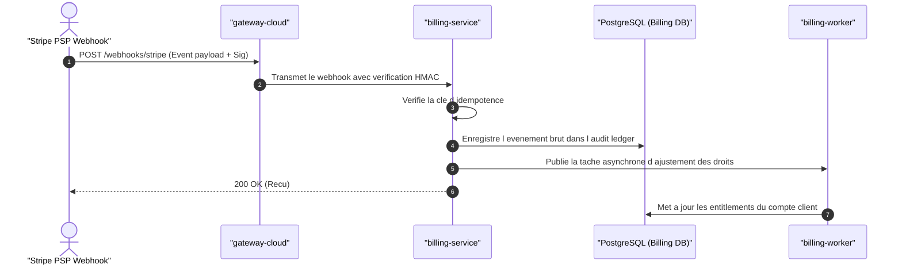

## 1. Rôle Architectural

Gestionnaire des souscriptions, du calcul d usage et de la synchronisation des états de facturation.

- **Domaine métier** : `billing`
- **Mécanisme d'authentification** : gRPC mTLS interne + Signature HMAC des webhooks Stripe
- **Scopes requis** : `billing:read`, `billing:admin`

---

## 2. Invariants & Règles Métier

Ces règles constituent les garanties fondamentales du service :

- **Règle** : Tous les webhooks PSP (Stripe) doivent être traités avec une idempotence stricte.
- **Règle** : Le routage des paiements est neutre vis-à-vis des fournisseurs (ADR 0004).
- **Règle** : Aucun changement de statut de souscription n est appliqué sans audit append-only.

---

## 3. Flux Principal (Diagramme de Séquence)

---

## 4. Matrice des Erreurs & Stratégies de Résilience

| Type d'Erreur | Code HTTP | Stratégie de Récupération |
| :--- | :--- | :--- |
| `InvalidWebhookSignature` | `400` | Rejeter immédiatement la requête et alerter la sécurité. |
| `DuplicateEventIgnored` | `200` | Renvoyer 200 OK sans retraiter l événement (Idempotence). |
| `PaymentFailed` | `402` | Notifier le client par email et entrer en période de grâce. |
