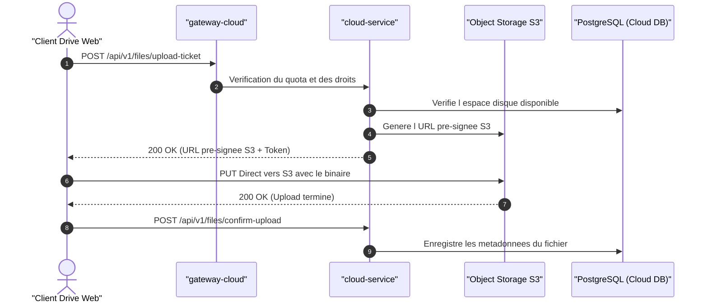

## 1. Rôle Architectural

API de stockage objet, gestion des espaces partagés, métadonnées de fichiers et contrôle d accès fin.

- **Domaine métier** : `cloud`
- **Mécanisme d'authentification** : Bearer DPoP JWT (émis par Identity)
- **Scopes requis** : `drive:read`, `drive:write`, `drive:share`, `drive:admin`

---

## 2. Invariants & Règles Métier

Ces règles constituent les garanties fondamentales du service :

- **Règle** : Tout upload direct vers le stockage objet nécessite une URL pré-signée validée par cloud-service.
- **Règle** : Les quotas d espace disque sont vérifiés de manière atomique avant l émission des tokens d upload.
- **Règle** : Le partage de documents applique un modèle de permissions immuable avec révocation instantanée.

---

## 3. Flux Principal (Diagramme de Séquence)

---

## 4. Matrice des Erreurs & Stratégies de Résilience

| Type d'Erreur | Code HTTP | Stratégie de Récupération |
| :--- | :--- | :--- |
| `QuotaExceeded` | `402` | Inviter l utilisateur à mettre à niveau son abonnement de stockage. |
| `UnauthorizedAccess` | `403` | Refuser l accès, journaliser l événement dans l audit append-only. |
| `FileNotFound` | `404` | Vérifier la validité de l identifiant ou si le fichier a été purgé. |
