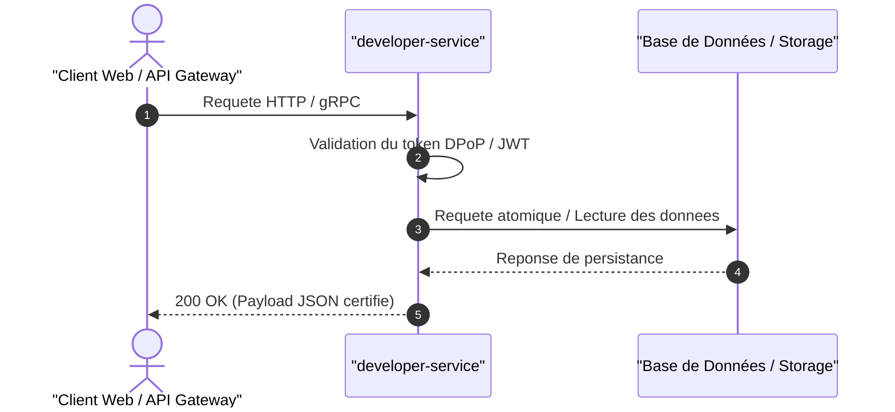

import { Badge, Card, CardGrid, Aside } from '@astrojs/starlight/components';

## 1. Rôle Architectural & Responsabilités

Le service **developer-service** est un microservice backend écrit en **Rust (Axum)** responsable du domaine `developer`.

- **Répertoire source** : `apps/developer-service`
- **Cible de build** : `cargo build -p developer-service`
- **Dépendances majeures** : Primitives standards

---

## 2. Invariants & Garanties Métier

<Aside type="tip" title="Invariants Fondamentaux">
- **Isolation de Domaine** : Logique métier autonome sans dépendance circulaire.
- **Sécurité des Données** : Chiffrement en transit et conformité avec les politiques monorepo.
- **Contrats Typés** : Synchronisation continue avec les spécifications OpenAPI certifiées.
</Aside>

---

## 3. Flux Principal (Diagramme de Séquence)



---

## 4. Endpoints & Opérations Clés (38 routes)

| Méthode | Route | Description |
| :--- | :--- | :--- |
| `GET` | `/developer/apps` | list_apps |
| `POST` | `/developer/apps` | create_app |
| `GET` | `/developer/apps/{clientId}` | get_app |
| `DELETE` | `/developer/apps/{clientId}` | revoke_app |
| `PATCH` | `/developer/apps/{clientId}/redirects` | update_redirects |
| `GET` | `/developer/console/context` | context |
| `GET` | `/developer/console/health-checks` | list_health_checks |
| `POST` | `/developer/console/health-checks` | run_health_checks |
| `GET` | `/developer/console/logs` | list_api_logs |
| `GET` | `/developer/console/marketplace/apps` | list_marketplace_apps |

---

## 5. Guide de Maintenance & Commandes

```bash
# Lancer les tests unitaires du service
cargo test -p developer-service

# Mettre à jour et valider la documentation du service
pnpm doc:fix
```
