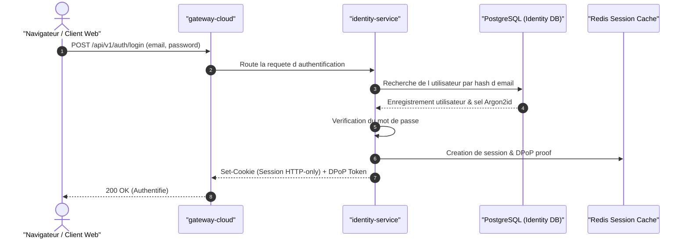

## 1. Rôle Architectural

Fournisseur central d identité, émetteur de jetons DPoP JWT et gestionnaire de credentials pour l ensemble de l écosystème nvbes.

- **Domaine métier** : `identity`
- **Mécanisme d'authentification** : DPoP JWT + WebAuthn + Sessions HTTP-only cookies
- **Scopes requis** : `openid`, `profile`, `email`, `offline_access`

---

## 2. Invariants & Règles Métier

Ces règles constituent les garanties fondamentales du service :

- **Règle** : Les mots de passe ne sont jamais stockés en clair (hachage Argon2id obligatoire).
- **Règle** : Toute session WebAuthn / FIDO2 doit valider le challenge cryptographique côté serveur.
- **Règle** : Les jetons d accès utilisent le protocole DPoP (RFC 9449) pour lier le token à la clé privée du client.
- **Règle** : Les flux OAuth2 supportent obligatoirement PKCE (S256).

---

## 3. Flux Principal (Diagramme de Séquence)

---

## 4. Matrice des Erreurs & Stratégies de Résilience

| Type d'Erreur | Code HTTP | Stratégie de Récupération |
| :--- | :--- | :--- |
| `InvalidCredentials` | `401` | Incrémenter le compteur d échecs, inviter à réinitialiser le mot de passe. |
| `SessionExpired` | `401` | Rediriger vers le flux de ré-authentification ou rafraîchir via Refresh Token. |
| `MfaRequired` | `403` | Déclencher le challenge WebAuthn ou TOTP. |
