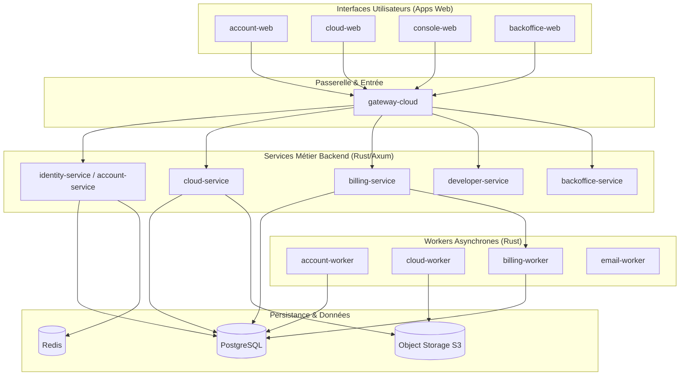

import { Card, CardGrid, Badge, Aside } from '@astrojs/starlight/components';

## Topologie du Système

La plateforme **nvbes** est architecturée sous forme de microservices modulaires écrits en **Rust (Axum)** avec des frontends en **React (TanStack Router & Query)** et des workers asynchrones pour les tâches de fond.

---

## Cartographie des Microservices

<CardGrid>
  <Card title="identity-service" icon="open-book">
    <Badge text="Port : 8081" variant="note" /> <Badge text="Rust / Axum" variant="success" />
    Fournisseur d'identité, gestion des sessions, flux OAuth2/PKCE et tokens DPoP JWT.
    [Voir l'architecture Identity](/architecture/identity-service/).
  </Card>
  <Card title="cloud-service" icon="document">
    <Badge text="Port : 8082" variant="note" /> <Badge text="Rust / Axum" variant="success" />
    Gestion des fichiers, espaces partagés, quotas et tickets d'upload S3 pré-signés.
    [Voir l'architecture Cloud](/architecture/cloud-service/).
  </Card>
  <Card title="billing-service" icon="laptop">
    <Badge text="Port : 8083" variant="note" /> <Badge text="Rust / Axum" variant="success" />
    Moteur de souscription, calcul d'usage et synchronisation des webhooks Stripe idempotents.
    [Voir l'architecture Billing](/architecture/billing-service/).
  </Card>
  <Card title="gateway-cloud" icon="setting">
    <Badge text="Port : 8080" variant="note" /> <Badge text="Rust / Axum" variant="success" />
    Point d'entrée unique, terminaison TLS, validation CORS et routage vers les microservices.
    [Voir la matrice de dépendances](/generated/architecture-matrix/).
  </Card>
</CardGrid>

---

## Principes Directeurs

<Aside type="tip" title="Conventions d'Architecture Monorepo">
  1. **Isolation stricte des domaines** : Chaque microservice possède sa propre logique métier et sa base de données dédiée.
  2. **Structure plate (*Flat dot-notation*)** : Tous les fichiers Rust résident à la racine de `src/` pour une exploration sans friction.
  3. **Contrats OpenAPI stricts** : Toutes les APIs génèrent automatiquement leur schéma `openapi.json`.
  4. **Limite de 300 lignes** : Aucun fichier ne doit dépasser 300 lignes (contexte LLM optimal et zéro dilution).
</Aside>
