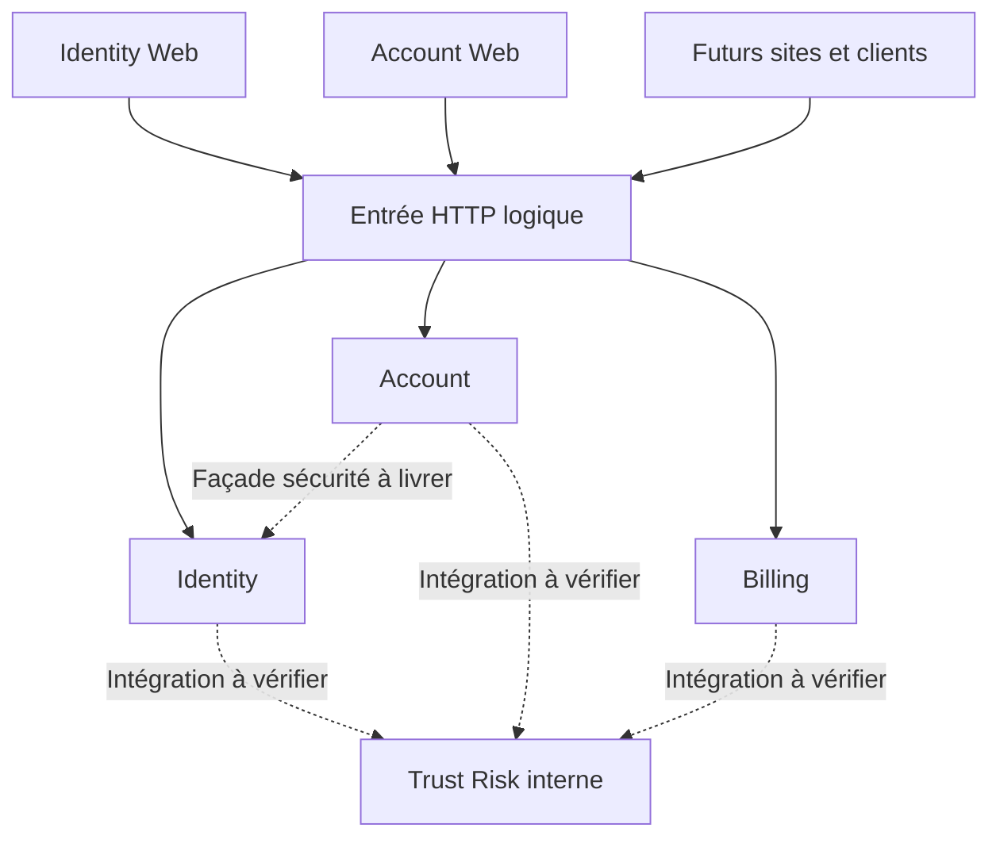

# Préparation des frontends du socle nvbes

## Statut et périmètre

Plan proposé le 2026-09-07, inventaire statique du checkout `94cba92c`.
Ce document ne certifie ni un déploiement ni une validation de bout en bout.
L'[ADR 0013](../adr/0013-multi-site-client-api-boundaries.md) expose les choix.
La [direction V1](../product/nvbes-product-strategy.md) reste l'autorité produit.

Les noms de sites ci-dessous sont logiques : aucun domaine, port frontend ou
enregistrement OAuth n'est créé par ce plan.

## Applications et frontières

| Application               | Responsabilité                                                                         | Services concernés                     | Accès proposé                                                                                                                |
| ------------------------- | -------------------------------------------------------------------------------------- | -------------------------------------- | ---------------------------------------------------------------------------------------------------------------------------- |
| Identity Web, maintenant  | Authentification, récupération, MFA et consentement nécessaires au parcours OAuth/OIDC | Identity, Account, Trust/Risk          | Navigateur vers Identity ; besoin Account précis à contractualiser côté serveur ; Risk interne                               |
| Account Web, maintenant   | Profil, préférences, équipes, confidentialité, sécurité, facturation                   | Account, Identity, Trust/Risk, Billing | API Account ; redirection Identity ; façade Account pour sécurité Identity ; API Billing avec audience propre ; Risk interne |
| Landing, plus tard        | Présentation                                                                           | Trust/Risk                             | Protection edge ; collecte publique seulement si justifiée, jamais API de décision interne                                   |
| Home, plus tard           | Accueil personnalisé                                                                   | Identity, Account, Trust/Risk          | Client OIDC distinct, API Account, protection Risk côté serveur                                                              |
| Desktop/Mobile, plus tard | Expériences natives à définir                                                          | Capacités publiques autorisées         | Clients OAuth distincts par plateforme/environnement, contrats indépendants de React                                         |
| TV/Watch, plus tard       | Expériences contraintes à définir                                                      | Capacités publiques minimales          | Flux de connexion à choisir selon autonomie et capacités du terminal                                                         |

Les liens représentent la cible. Ni la gateway ni les intégrations Risk ne
sont attestées comme livrées par ce diagramme. Health, métriques, opérations,
webhooks fournisseur et RPC internes ne sont pas des routes du SDK utilisateur.

## Matrice des parcours et contrats observés

Les chemins sont ceux des services, avant toute éventuelle réécriture edge.
« Présent » signifie route montée et handler inspecté, pas parcours validé.
Les audiences cibles sont `nvbes-account-service` et `nvbes-billing-service`.

| Site / parcours                                   | Méthode et endpoint service                                                       | Permission observée ou cible                                     | État / dépendance                                                             |
| ------------------------------------------------- | --------------------------------------------------------------------------------- | ---------------------------------------------------------------- | ----------------------------------------------------------------------------- |
| Account → Identity : connexion                    | Autorisation, token, discovery, JWKS : chemins à contractualiser                  | Cible OIDC `openid`, scopes Account minimaux, PKCE S256          | Bloqué : aucune route OAuth/OIDC montée dans Identity actif                   |
| Identity : login, récupération, MFA, consentement | Contrats HTTP à définir                                                           | Session de transaction Identity ; aucun secret client navigateur | Primitives internes présentes, interface HTTP non exposée                     |
| Account : callback et logout                      | Routes frontend et révocation/fin de session à définir                            | Transaction liée au client, audience et issuer vérifiés          | Bloqué par protocole et politique de session                                  |
| Account : lire/modifier profil                    | `GET`, `PUT /api/v1/profile`                                                      | `account:read`, `account:write`                                  | Présent ; profil rattaché au principal                                        |
| Account : préférences                             | `GET`, `PUT /api/v1/preferences`                                                  | `account:read`, `account:write`                                  | Présent                                                                       |
| Account : notifications                           | `GET`, `PUT /api/v1/notifications`                                                | `account:read`, `account:write`                                  | Présent                                                                       |
| Account : lister/créer équipe                     | `GET`, `POST /api/v1/teams`                                                       | `account:read`, `account:write`                                  | Présent ; permissions sur ressources à tester                                 |
| Account : rejoindre équipe                        | `POST /api/v1/teams/join`                                                         | `account:write`                                                  | Présent ; tester invitation invalide/consommée                                |
| Account : demander export                         | `POST /api/v1/privacy/exports`                                                    | `account:export` + step-up                                       | Présent ; parcours MFA Identity bloquant                                      |
| Account : suivre/télécharger export               | `GET /api/v1/privacy/exports/latest`, `GET /api/v1/privacy/exports/{id}/document` | `account:export` ; step-up au téléchargement                     | Présent ; tester isolation et expiration                                      |
| Account : fermeture                               | `GET`, `POST /api/v1/closure`, `POST /api/v1/closure/cancel`                      | `account:close` ; step-up sur mutations                          | Présent ; orchestration interdomaines à valider                               |
| Account : gérer MFA, sessions et identifiants     | Façade Account vers Identity à définir                                            | Scopes et délégation à contractualiser                           | Absente de la surface Account inspectée ; ne pas appeler les routes archivées |
| Account : offres Billing                          | `GET /billing/plans`                                                              | Catalogue public actuel                                          | Présent ; aucun paiement réel autorisé par ce plan                            |
| Account : synthèse Billing                        | `GET /workspaces/{id}/billing/overview`                                           | `billing:read`                                                   | Présent mais bloqué par gates Billing ci-dessous                              |
| Account : checkout                                | `POST /workspaces/{id}/billing/checkout`                                          | `billing:write`                                                  | Présent ; autorisation compte et environnement test à démontrer               |
| Account : portail fournisseur                     | `POST /workspaces/{id}/billing/portal`                                            | `billing:read` actuellement                                      | Présent ; permission d'action à revoir selon capacités du portail             |
| Sites : protection Risk                           | RPC internes, pas d'endpoint navigateur retenu                                    | Authentification de service, décision appliquée localement       | Runtime gRPC présent ; intégration de chaque parcours à démontrer             |

## Sources et écarts bloquants

L'[inventaire des mécanismes archivés](identity-archive-mechanisms-review.md)
évalue leur pertinence et les conditions de reprise dans le service actif.

- [Identity main](../../apps/identity-service/src/main.rs) monte uniquement
  health et métriques. [Tokens](../../apps/identity-service/src/identity.tokens.rs)
  et [auth](../../apps/identity-service/src/identity.auth.rs) sont des primitives
  internes ; ils ne constituent pas un serveur OAuth/OIDC HTTP livré.
  La [PR Identity 175](https://github.com/nvbes-org/nvbes/pull/175) est ouverte
  au relevé : rebaser l'inventaire après son intégration, sans présumer son contenu.
- Account : [profil](../../apps/account-service/src/account.profile.rs),
  [préférences](../../apps/account-service/src/account.preferences.rs),
  [équipes](../../apps/account-service/src/account.teams.rs),
  [confidentialité](../../apps/account-service/src/account.privacy.rs) et
  [auth](../../apps/account-service/src/account.auth.rs) fondent la matrice.
  Le step-up vérifie `amr` (`totp` ou `webauthn`) ; il ne prouve pas à lui seul
  la fraîcheur de la réauthentification. Définir puis tester cette fraîcheur.
- [Routeur Billing](../../apps/billing-service/src/billing.app.rs) : seules
  offres, overview, checkout et portail constituent les routes utilisateur
  inspectées. Les autres méthodes du
  [client Billing](../../libs/ts/billing-client/src/billing.client.ts), dont
  factures, cartes et usage, ne prouvent pas l'existence des routes serveur.
  Son transport par défaut utilise les cookies sans fournir de bearer :
  préparer un transport explicite et tester le contrat avant de le brancher.
- [Auth Billing](../../apps/billing-service/src/billing.auth.rs) désactive la
  validation d'audience et n'impose pas l'issuer dans le vérificateur inspecté.
  Il accepte aussi un mode sans clé. Bloquer l'ouverture utilisateur jusqu'à
  validation stricte et isolation démontrée du mode de développement.
- [Portail/overview Billing](../../apps/billing-service/src/billing.portal.rs)
  vérifient les scopes puis utilisent l'identifiant fourni dans le chemin.
  Aucun contrôle d'appartenance n'y est visible : définir la correspondance
  principal/équipe/compte facturé et prouver le refus des accès intercomptes.
  Ne pas assimiler automatiquement `workspace_id` à une équipe Account.
- [Trust/Risk](../../apps/trust-risk-service/src/main.rs) expose des RPC.
  Leur existence ne démontre pas les appels depuis Identity/Account/Billing.
  Documenter par opération les signaux, délais, budgets et comportements
  d'indisponibilité ; garder la décision sensible côté serveur.
- Les SDK Identity et anciens schémas doivent être comparés au nouveau runtime.
  Aucune réutilisation automatique des contrats sous `archive/`.

## Contrat de session et compatibilité proposé

- Account Web est un client public Code + PKCE S256 ; Identity Web fait partie
  de l'expérience de l'Authorization Server, pas d'un client OAuth générique.
- Enregistrer séparément chaque application et environnement : issuer,
  identifiant client, redirections exactes, origines autorisées, ressources et
  scopes. Aucun secret confidentiel dans une application distribuée.
- Lier callback, `state`, `nonce` et vérificateur PKCE à une transaction ;
  consommer une fois le code. Proposer les tokens web en mémoire, jamais en URL
  ni stockage persistant ; finaliser la reprise après rechargement, les onglets,
  la rotation et la révocation avant implémentation du renouvellement.
- Le cookie SSO appartient à Identity (Secure, HttpOnly, portée hôte limitée).
  Fixer SameSite selon les redirections retenues et tester CSRF ; aucun cookie
  SSO partagé accepté comme credential par Account ou Billing.
- Déconnexion locale : vider tokens/cache du client. Déconnexion Identity et
  révocation globale : actions distinctes dont les effets et délais doivent être
  documentés ; ne pas promettre l'invalidation immédiate d'un JWT hors contrôle.
- Mobile/Desktop : navigateur système + PKCE, stockage sécurisé du système,
  redirections adaptées à la plateforme. TV autonome : Device Authorization à
  envisager, non implémenté par ce plan. Watch : distinguer application autonome
  et compagnon du téléphone avant de choisir le flux.
- Versions et dépréciations explicites, changements additifs compatibles,
  erreurs stables, annulation/timeout et stratégie de reprise par opération.
  Ne jamais relancer aveuglément une mutation de paiement. Les clients installés
  doivent être testés contre la version suivante de l'API.

Références : [sécurité OAuth](https://www.rfc-editor.org/rfc/rfc9700.html),
[applications natives](https://www.rfc-editor.org/rfc/rfc8252.html),
[Device Authorization](https://www.rfc-editor.org/rfc/rfc8628.html).

## Lots ordonnés et critères d'acceptation

| Lot / propriétaire de domaine | Livrable                                                                                     | Gate de sortie                                                                                                      |
| ----------------------------- | -------------------------------------------------------------------------------------------- | ------------------------------------------------------------------------------------------------------------------- |
| 0 — Architecture              | Accepter/amender ADR 0013 ; arrêter origines, sessions, profils clients et mapping Billing   | Aucune décision d'exposition ou de credential implicite                                                             |
| 1 — Identity                  | Protocole HTTP/OIDC et contrats des écrans hébergés actifs                                   | Tests discovery, PKCE invalide, code rejoué, redirect refusée, issuer/audience, MFA, révocation ; coordonner PR 175 |
| 2 — Account/Identity          | Contrats OpenAPI actifs et client Account aligné ; token Account obtenu par le vrai parcours | Connexion puis profil possibles sans tokens synthétiques ; refus scope/audience étrangère                           |
| 3 — Web                       | Deux projets Nx, composants du registry existant, React/Vite et conventions runtime          | Deux sites lancés avec le socle par `pnpm dev`, callback et logout réels, isolation du cache entre comptes          |
| 4 — Account/Trust             | Façade sécurité, step-up et contrôles Risk par opération                                     | Refus interutilisateur, MFA insuffisante/ancienne, indisponibilité Risk testée ; parcours complets ou absents       |
| 5 — Billing                   | Corriger vérification tokens, autorisation ressource et couverture SDK ; flux token Billing  | Token Account refusé, compte tiers refusé, checkout/portail sandbox, retour et reprise testés                       |
| 6 — Platform Operations       | Hébergement, routage, observations et rollback des deux sites                                | Budget TTC 30 EUR démontré, accès interne d'abord, parcours et restauration prouvés                                 |

Le lot 3 commence après les contrats des lots 1–2. Les parcours Billing restent
fermés jusqu'au lot 5. Les applications futures ne déclenchent ni ressources ni
nouveaux services maintenant. Chaque lot logiciel doit fournir ses checks ciblés
Nx et tests utiles ; tout changement Rust impose `cargo check --workspace`.

Premier scénario d'acceptation : ouvrir Account sans session, passer par
Identity, revenir au callback, lire son profil et se déconnecter. Tester aussi
refus/annulation du login, expiration, rejeu du callback, tentative d'accès à un
autre compte et indisponibilité du service. Ensuite seulement ajouter équipes,
sécurité et Billing par parcours complets.
