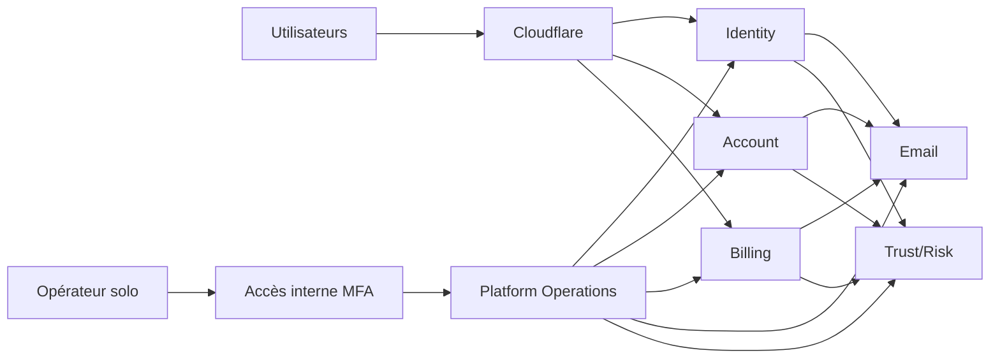

# Architecture technique du socle V1

## Autorité et périmètre

Cette architecture applique la
[direction produit V1](../product/nvbes-product-strategy.md). Elle décrit le
socle Identity, Account, Billing, Email, Trust/Risk et Platform Operations.
Cloud/Drive, le stockage de fichiers et les consoles Enterprise sont hors V1.

## Principes

- frontières de domaine strictes, même lorsque l'infrastructure est mutualisée ;
- aucune dépendance vers un produit final ;
- coût, sécurité, restauration et exploitation manuelle traités dès la
  conception ;
- scale-to-zero et capacité maximale bornée ;
- contrats versionnés pour toute interaction entre domaines ;
- automatisation ajoutée uniquement après un besoin mesuré ;
- aucune dette structurelle connue dans le périmètre livré.

## Stack

- Rust, Axum, Tokio et SQLx pour les runtimes backend ;
- PostgreSQL comme stockage transactionnel et outbox initiale ;
- TypeScript pour SDK, clients et futures interfaces web ;
- OpenAPI et gRPC/Protobuf pour les contrats synchrones ;
- Cloudflare pour DNS, TLS, edge et accès interne ;
- Scaleway serverless pour compute, PostgreSQL et email ;
- OpenTelemetry, Grafana Cloud et Sentry dans les paliers gratuits disponibles.

Redis, Kafka, ClickHouse, Kubernetes, moteur de workflow et stockage produit ne
sont pas des dépendances V1. Ils exigent un besoin et un budget démontrés.

## Bounded contexts

### Identity

Possède authentification, credentials, sessions, récupération, MFA, step-up et
décisions d'autorisation liées à l'identité. Identity ne possède ni profil
produit ni abonnement.

### Account

Possède profil, préférences, cycle de vie du compte et relations d'équipe. Les
équipes sont des primitives B2C collaboratives ; la gouvernance Enterprise est
future.

### Billing

Possède catalogue, prix, abonnements, paiements, entitlements, webhooks et
réconciliation. Le fournisseur de paiement reste derrière un port explicite.

### Email

Possède acceptation durable, rendu, livraison, retries, suppressions et
événements fournisseur. Email est le premier adaptateur d'un contrat de
notification réutilisable.

### Trust/Risk

Possède signaux transversaux, corrélation, réputation et recommandations
explicables. Le domaine appelant conserve la décision d'enforcement. La première
production fonctionne en shadow mode.

### Platform Operations

Possède dossiers opérateur, décisions humaines, commandes, recours, registre de
coûts et vue consolidée des audits. Il ne modifie jamais directement les bases
des autres services et n'usurpe pas les sessions utilisateur.

## Topologie V1

- chaque runtime Scaleway a `min_scale = 0` et un maximum explicite ;
- chaque bounded context garde sa propre base logique, ses credentials et ses
  migrations ;
- aucun schéma métier n'est partagé entre services ;
- staging et previews sont éphémères ;
- les tâches ponctuelles utilisent des jobs serverless ;
- la région, le registry et l'observabilité sont mutualisés lorsque cela réduit
  le coût sans mélanger les responsabilités.

## Capacités partagées

Restent des bibliothèques, modules ou contrats tant qu'une extraction n'est pas
justifiée :

- audit append-only ;
- idempotence, outbox, jobs, retries et dead-letter ;
- auth interservices ;
- propagation des identifiants de corrélation ;
- erreurs, traces et métriques ;
- quotas, unités de coût et budget FinOps ;
- feature flags et kill switches ;
- rate limiting ;
- contrats de notification ;
- SDK générés depuis les contrats.

Une capacité devient un service seulement si des mesures démontrent un cycle de
vie de données autonome, un déploiement ou une disponibilité indépendants,
plusieurs consommateurs réseau stables ou une contention réelle.

## Communications

Les appels synchrones utilisent HTTP ou gRPC versionné avec timeout, politique
de retry et mode dégradé explicites. Un timeout ne vaut jamais succès.

Les événements V1 utilisent une outbox PostgreSQL durable, idempotente et
rejouable. Aucun broker permanent n'est ajouté sans volume ou isolation mesuré.

## Administration et sécurité

- le premier opérateur reçoit `platform_owner`, jamais une permission codée sur
  un email ;
- lecture et action sont séparées ;
- MFA et step-up protègent les commandes sensibles ;
- les données personnelles sont masquées par défaut ;
- chaque commande sensible exige motif et clé d'idempotence ;
- une action destructive est différée et annulable lorsqu'elle peut l'être ;
- les demandes rares sont traitées manuellement et auditées.

Les rôles futurs de support, risque, billing et sécurité restent distincts dans
le modèle, même s'ils ne sont pas attribués en V1.

## FinOps et modes dégradés

Le contrat versionné fixe une cible à 20 EUR TTC et une limite absolue à 30 EUR
TTC par mois. Chaque domaine déclare coût fixe, unité marginale, quotas,
prévision à 30 jours, traitements essentiels et mode économique dégradé.

- 25 EUR : désactiver les traitements non essentiels ;
- 28 EUR : geler la création de nouvelles charges ;
- 30 EUR : conserver uniquement les parcours essentiels à l'intégrité des
  comptes et paiements existants.

Les factures et estimations TTC vérifiées manuellement sont l'autorité jusqu'à
la livraison d'une collecte automatique réellement fiable et gratuite.

## Résilience et données

- migrations versionnées et protégées ;
- sauvegardes chiffrées et restauration démontrée ;
- RPO initial inférieur ou égal à 24 heures ;
- RTO initial inférieur ou égal à 8 heures ;
- logs, audits et analytics séparés ;
- secrets limités au service concerné ;
- aucune télémétrie ne bloque un parcours utilisateur.

Ces objectifs supposent une intervention manuelle et ne constituent pas un SLA.

## Gate d'extraction d'un produit

Le socle est validé lorsqu'un compte synthétique traverse Identity et Account,
qu'Email livre et trace ses messages, que Billing réconcilie un parcours de test,
que Trust/Risk produit une recommandation shadow, que Platform Operations traite
un dossier sûr, que la restauration est démontrée et que les coûts restent sous
les deux gates.

La connexion du premier produit nécessite ensuite une conception séparée.
