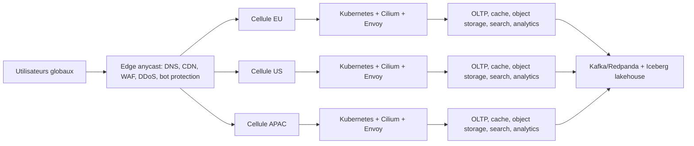

# Plan Plateforme Globale - Stack Zero

## Objectif

Documenter une architecture cible construite depuis zero pour les futurs produits nvbes, sans tenir compte de la stack actuelle.

La cible privilegie:

- robustesse multi-region;
- scalabilite horizontale massive;
- multi-cloud et portabilite;
- souverainete EU avec Scaleway comme ancrage regional possible;
- isolation forte entre tenants, produits et workloads;
- capacite a absorber des milliards de connexions ou utilisations simultanees par distribution cellulaire.

Cette architecture n'est pas le plan de migration V1. C'est une direction long terme pour une plateforme hyperscale.

## Principe Central

Ne pas construire une seule plateforme globale monolithique.

Construire des cellules independantes par region, tenant majeur, produit ou famille de charge. Chaque cellule doit pouvoir servir du trafic, se degrader, etre isolee, etre remplacee et etre coupee du reste sans faire tomber toute la plateforme.

## Edge Global

Choix cible:

- Cloudflare Enterprise pour DNS, anycast, WAF, bot management, DDoS, load balancing, Workers et R2.
- Fastly comme second edge/CDN pour strategie multi-CDN et failover fournisseur.
- Routage par latence, region de residence des donnees, sante des cellules et politique tenant.
- Workers/edge functions pour redirects, bot decisions rapides, pre-auth, cache headers et logique edge non sensible.

Regle: toute entree publique passe par l'edge. Les origins ne sont pas exposes directement.

## Multi-Cloud et Interconnexion

Scaleway peut etre l'ancrage EU pour workloads europeens, donnees EU, object storage et compute regional.

Il ne doit pas etre le seul point critique global. La cible multi-cloud doit inclure:

- Scaleway EU pour souverainete et controle cout;
- AWS pour services globaux matures, Direct Connect, regions nombreuses et ecosysteme;
- Google Cloud pour Cross-Cloud Interconnect, data/AI et reseau global;
- Azure si besoin enterprise, Microsoft 365, ExpressRoute ou clients grands comptes;
- colocation ou provider reseau neutre pour interconnexion privee si le volume justifie.

Interconnexion cible:

- liens prives dedies pour trafic critique: AWS Direct Connect, Google Cloud Interconnect/Cross-Cloud Interconnect, Azure ExpressRoute;
- VPN WireGuard/IPsec seulement comme backup ou phase initiale;
- BGP, segmentation par VPC/VNet, firewalling strict et routes explicites;
- pas de dependance au public internet pour replication critique entre clouds;
- egress et couts reseau suivis par region, produit et tenant.

## Compute et Orchestration

Choix cible:

- Kubernetes par cellule, jamais un cluster mondial unique.
- Cilium/eBPF pour networking, network policies, observabilite reseau et securite.
- Envoy Gateway pour ingress applicatif et L7 routing.
- Istio ambient ou SPIFFE/SPIRE pour mTLS et identite workload sur domaines sensibles.
- Karpenter/Cluster Autoscaler selon cloud pour elasticite.
- Node pools separes: API, realtime, workers, GPU, storage-heavy, builds, sandbox.

Regles:

- services stateless par defaut;
- state chaud garde local a la cellule;
- graceful degradation obligatoire;
- quotas et admission control avant saturation;
- deploiements canary, blue/green ou progressive delivery;
- aucune charge non fiable executee dans le meme plan que les services internes critiques.

## Execution Non Fiable: PaaS, FaaS, Vercel-like

Le code utilisateur doit etre isole plus fortement que des pods Kubernetes standards.

Choix cible:

- Firecracker microVMs ou isolation equivalente pour fonctions et builds non fiables;
- sandbox reseau stricte, egress policy, quotas CPU/memoire/I/O;
- artefacts OCI immuables;
- registry multi-region;
- logs et metriques separes par tenant;
- workers d'execution ephemeres;
- image scanning et policy admission avant execution.

Kubernetes orchestre l'infrastructure, mais ne remplace pas une vraie isolation de code non fiable.

## Donnees Transactionnelles

Choix cible par type:

- CockroachDB pour OLTP SQL distribue, multi-region, forte resilience et transactions globales quand le modele le justifie.
- YugabyteDB comme alternative si la compatibilite PostgreSQL et l'open-source priment.
- PostgreSQL regional pour cellules simples, outils internes, backoffices ou produits encore regionaux.
- FoundationDB a evaluer uniquement pour besoins transactionnels key-value tres specialises.

Regle: ne pas mettre toutes les donnees dans une seule base globale. Les donnees doivent etre partitionnees par tenant, region, produit et niveau de criticite.

## Hot Path Massif

Choix cible:

- ScyllaDB pour chat, timelines, events utilisateur, presence durable, sessions massives non transactionnelles et features anti-bot.
- Cassandra reste un candidat de comparaison, mais ScyllaDB est la cible preferentielle si la priorite est latence previsible et debit eleve.
- Redis/Valkey ou DragonflyDB pour cache, session courte duree, rate limit et decisions edge/regionales.

Regle: le cache n'est pas la source de verite. ScyllaDB n'est pas un moteur de jointures ou d'analytics ad hoc.

## Object Storage

Choix cible:

- API S3-compatible partout.
- Object storage managed par cloud pour production regionale.
- Cloudflare R2 pour assets edge, distribution globale et reduction d'egress quand adapte.
- Ceph pour self-managed robuste a tres grande echelle.
- MinIO pour clusters S3-compatible plus simples ou environnements controles.

Les fichiers utilisateur, media, builds, exports, recordings, snapshots et datasets bruts vont dans object storage. Les bases gardent les metadonnees et les index.

## Messaging, Streaming et Jobs

Choix cible:

- Kafka ou Redpanda comme commit log durable.
- NATS pour messaging faible latence, control plane, edge et coordination simple.
- Flink pour stream processing: anti-fraude, bot detection, enrichissement temps reel, analytics et alerting.
- DLQ, retries, idempotence et backpressure obligatoires pour tout workflow critique.

Regle: pas de dual-write applicatif non controle. Preferer outbox, CDC et event log.

## Analytics, DaaS et Public Data

Choix cible:

- ClickHouse pour analytics temps reel, logs, metriques produit, clickstream, bot detection et dashboards.
- Apache Iceberg sur object storage pour lakehouse ouvert, historique long terme, DaaS et datasets publics.
- Trino pour requetes federes et exploration SQL du lakehouse.
- Spark ou Flink pour transformations lourdes.
- Apache Pinot si besoin d'analytics user-facing sub-second a tres haute concurrence.

Regle: separer OLTP et OLAP. Les requetes analytiques lourdes ne doivent pas frapper les bases transactionnelles.

## Search et IA

Choix cible:

- OpenSearch ou Elasticsearch pour recherche full-text, documents, mail, audit exploratoire et logs recherches.
- pgvector pour demarrage simple sur petits volumes regionaux.
- Qdrant, Milvus ou Weaviate pour vector search dedie quand le volume, la latence ou le RAG le justifie.
- Index vectoriels par region pour residence des donnees et latence.

## Security Architecture

Exigences cible:

- zero trust interne;
- identite workload via SPIFFE/SPIRE ou equivalent;
- mTLS pour trafic service-to-service sensible;
- HSM/KMS pour cles critiques, wallet, identity verifier et signatures;
- Vault ou secret manager cloud avec rotation, audit et acces least privilege;
- chiffrement at-rest et in-transit;
- segmentation reseau par environnement, produit et sensibilite;
- politique deny-by-default;
- audit append-only pour actions sensibles;
- confidential computing a evaluer pour KYC, wallet, clefs et calculs sensibles.

Pour Identity Verifier, les documents et visages bruts ne doivent pas etre stockes long terme. Le systeme garde uniquement status, claims, consentements, preuves, commitments, expiration et revocation.

## Observabilite et Operations

Choix cible:

- OpenTelemetry pour traces, metriques et logs instrumentes.
- Prometheus/Mimir ou equivalent pour metriques.
- ClickHouse pour logs et evenements a tres grand volume.
- Grafana pour dashboards et alerting.
- SLO par produit, region et tenant.
- error budgets et autoscaling bases sur signaux metier, pas seulement CPU.
- chaos drills et exercices de failover regionaux.

## Mapping Produits

- Identity Center: CockroachDB/YugabyteDB, HSM/KMS, WebAuthn/passkeys, Valkey, audit vers ClickHouse.
- Desktop Suite Drive/Doc/Slide/Sheets: object storage, OLTP metadata, OpenSearch, CRDT/OT, Kafka/NATS, snapshots.
- PDF/Document Signer: OLTP fort, signatures HSM/KMS, audit immutable, object storage.
- Calendar/Tasks/Boards/Forms: OLTP regional, cache Valkey, events Kafka/NATS.
- Meet: SFU dedie, regions proches utilisateurs, object storage recordings, ClickHouse QoS.
- Chats: ScyllaDB pour messages/timelines a grande echelle, NATS pour presence chaude, OpenSearch pour recherche.
- Mailbox: object storage MIME/attachments, OLTP metadata, OpenSearch, ClickHouse deliverability.
- Site/Link Marketing: edge routing, Valkey hot routes, OLTP config, ClickHouse clickstream.
- Photo/Video Editors: object storage, GPU workers, queues durables, pipeline media isole.
- PaaS/FaaS/Vercel-like: Firecracker, Kubernetes, Envoy, registry OCI, ClickHouse logs.
- SaaS: OLTP multi-tenant, Valkey, ClickHouse usage/billing.
- DaaS/Public Datas: Iceberg, object storage, Trino, ClickHouse serving layer.
- Identity Verifier: encrypted OLTP, HSM/KMS, no raw artifacts, consent and revocation registry.
- Web3/Wallet: internal double-entry ledger, HSM/MPC, chain indexers, ClickHouse risk analytics.
- Bot Detection/Protection: edge WAF/bot, Valkey decisions, ScyllaDB features, Flink, ClickHouse.
- Social Media Account Manager: OLTP scheduler/accounts, object media, queues, ClickHouse analytics.

## Decisions a Ne Pas Prendre Trop Tot

- Ne pas choisir une seule base de donnees universelle.
- Ne pas passer tous les services en microservices avant d'avoir des frontieres claires.
- Ne pas deployer un service mesh global partout sans besoin de securite ou trafic L7 precis.
- Ne pas mettre les donnees personnelles ou hashes faibles on-chain.
- Ne pas construire un PaaS avec seulement Kubernetes si du code utilisateur non fiable est execute.
- Ne pas supposer qu'un fournisseur cloud unique peut couvrir souverainete, cout, latence et resilience globale.

## Phasage Recommande

1. Definir les cellules: regions, produits, tenants, residence des donnees, SLO.
2. Standardiser edge, DNS, WAF, DDoS, identity, audit et observabilite.
3. Construire une cellule EU de reference avec Scaleway + second cloud.
4. Ajouter le streaming durable et le lakehouse.
5. Isoler les hot paths: realtime, bot detection, media, PaaS/FaaS.
6. Ajouter les cellules US/APAC quand les besoins de latence ou residence le justifient.
7. Industrialiser failover, chaos drills, capacity planning et FinOps.

## Critere de Reussite

La plateforme est consideree correctement orientee hyperscale quand:

- une region peut tomber sans panne globale;
- un tenant majeur peut etre isole sans impacter les autres;
- les hot paths ne saturent pas les bases transactionnelles;
- les donnees EU peuvent rester en EU;
- les couts reseau et stockage sont attribuables;
- chaque produit a une source de verite claire;
- chaque flux critique a idempotence, audit, retry et DLQ;
- la securite ne depend pas d'un reseau interne implicitement fiable.

## Sources Publiques Consultees

- [Scaleway VPC](https://www.scaleway.com/en/vpc/)
- [AWS Direct Connect](https://aws.amazon.com/directconnect/)
- [Google Cloud Interconnect](https://docs.cloud.google.com/network-connectivity/docs/interconnect)
- [Azure ExpressRoute](https://learn.microsoft.com/en-us/azure/expressroute/expressroute-introduction)
- [Cloudflare Load Balancing](https://developers.cloudflare.com/reference-architecture/architectures/load-balancing/)
- [Cloudflare Magic Transit](https://www.cloudflare.com/network-services/products/magic-transit/)
- [Kubernetes](https://kubernetes.io/)
- [Cilium](https://cilium.io/)
- [CockroachDB](https://www.cockroachlabs.com/)
- [YugabyteDB](https://www.yugabyte.com/)
- [ScyllaDB](https://www.scylladb.com/)
- [Apache Kafka](https://kafka.apache.org/)
- [Apache Flink](https://flink.apache.org/)
- [ClickHouse](https://clickhouse.com/)
- [Apache Iceberg](https://iceberg.apache.org/)
- [Trino](https://trino.io/)
