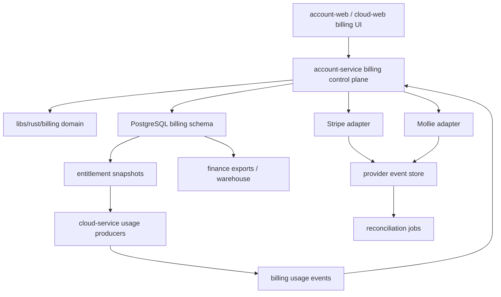

# Plateforme Billing Interne Multi-Provider Implementation Plan

> **For agentic workers:** REQUIRED SUB-SKILL: Use superpowers:subagent-driven-development (recommended) or superpowers:executing-plans to implement this plan task-by-task. Steps use checkbox (`- [ ]`) syntax for tracking.

**Goal:** internaliser la logique billing produit de nvbes tout en utilisant Stripe comme PSP principal et Mollie comme PSP secondaire.

**Architecture:** `nvbes` devient source de verite pour catalogue, pricing, entitlements, subscriptions, invoices, payments, ledger, usage, dunning, taxes calculees, reconciliation et reporting. Stripe et Mollie restent des adaptateurs PSP pour l'encaissement, le checkout, les moyens de paiement, les mandates, les refunds provider et les webhooks verifies. Le billing canonique vit dans `billing-service`; `account-service` expose seulement une facade account-facing vers Billing et `cloud-service` produit des usages et consomme des entitlements sans posseder la verite financiere.

**Tech Stack:** Rust stable, Axum, SQLx, PostgreSQL, pnpm/Nx, React/Vite/TanStack, Effect, Biome, contrats OpenAPI/events, workers async, audit append-only.

---

## Cadrage

Date de cadrage: 2026-06-21.

Ce plan complete `docs/adr/0001-billing-provider-stripe.md`: Stripe reste le provider billing V1 accepte, mais le modele metier doit etre provider-neutral. Mollie est integre comme second PSP quand le modele canonique est stable.

Depuis le refactor Account/Cloud, `docs/adr/2026-07-05-account-cloud-service-taxonomy.md` est l'autorite pour les frontieres runtime. Les references historiques a Identity ou Drive dans ce plan se lisent respectivement comme Account et Cloud uniquement quand elles designent une surface produit, jamais comme une autorisation de conserver un alias runtime legacy ou une vue compatibility apres le cutover.

Le but n'est pas de devenir banque, acquereur, reseau carte ou Merchant of Record. Le but est d'eviter que Stripe controle le modele produit, les droits d'acces, les cycles de subscription, les factures canoniques, le ledger et les donnees finance internes.

## Sources et contraintes externes

- Stripe SEPA Direct Debit supporte les paiements recurrents EUR avec notifications differees et disputes: <https://docs.stripe.com/payments/sepa-debit>
- Stripe Revenue Recognition peut servir de reference ou de sortie de comparaison, mais nvbes doit garder ses propres schedules simples: <https://docs.stripe.com/revenue-recognition/get-started>
- Stripe Data Pipeline illustre le besoin de pipeline finance vers warehouse, mais ne doit pas etre la seule source analytique: <https://stripe.com/data-pipeline>
- Mollie Payments API et webhooks servent au second provider: <https://docs.mollie.com/reference/create-payment> et <https://docs.mollie.com/reference/webhooks-new>
- OSS TVA UE reduit le besoin d'enregistrement TVA pays par pays pour certaines ventes B2C transfrontalieres: <https://europa.eu/youreurope/business/taxation/vat/one-stop-shop/index_en.htm>
- Les regles de facturation TVA UE exigent des factures dans la plupart des transactions B2B et certaines transactions B2C: <https://taxation-customs.ec.europa.eu/taxation/vat/vat-businesses/invoicing_en>
- ViDA est adopte et se deploie progressivement jusqu'en 2035, avec impact e-invoicing/reporting B2B transfrontalier a partir de 2030: <https://taxation-customs.ec.europa.eu/news/adoption-vat-digital-age-package-2025-03-11_en>

Validation externe obligatoire avant lancement payant multi-pays: expert-comptable, fiscaliste UE, conditions Stripe/Mollie, politique de retention des pieces comptables, e-invoicing pays cibles.

## Frontiere d'internalisation

| Domaine          | Source de verite nvbes                              | Role Stripe/Mollie                                      |
| ---------------- | --------------------------------------------------- | ------------------------------------------------------- |
| Product catalog  | plans, add-ons, features, quotas, price versions    | objets Product/Price synchronises ou references         |
| Customer profile | tenant, entreprise, contact billing, pays, VAT ID   | customer provider et metadata minimale                  |
| Entitlements     | droits produit, lock/degrade/suspend, quotas        | aucun pouvoir direct sur les droits produit             |
| Usage metering   | events, rollups, corrections, snapshots             | reception eventuelle de meters agreges                  |
| Subscriptions    | cycle canonique, period, changes, trials, proration | subscription provider miroir si necessaire              |
| Invoices         | facture canonique, lignes, taxes, PDF, numerotation | invoice provider miroir ou paiement lie                 |
| Payments         | tentative, succes, echec, refund, dispute           | execution paiement et statut provider                   |
| Ledger           | append-only, credits, taxes, adjustments, balances  | source externe de reconciliation                        |
| Dunning          | grace period, retries policy, degradation produit   | retries provider optionnels                             |
| Tax              | calcul basique UE, evidence, OSS prep               | Stripe Tax/Mollie comme calcul ou validation secondaire |
| Fraud business   | trial abuse, multi-comptes, usage suspect           | fraude paiement provider                                |
| Reporting        | MRR/ARR/churn/rev rec simple/exports                | donnees provider importees pour reconciliation          |

## Non-Goals

- Ne pas collecter ni stocker PAN/CVV.
- Ne pas sortir du scope PCI reduit fourni par les PSP.
- Ne pas implementer 3DS/SCA, card acquiring, SEPA rails directs, Wero rails directs ou network tokens.
- Ne pas promettre une conformite fiscale automatique sans validation externe.
- Ne pas activer paiement crypto en V0; seul un ledger crypto interne preparatoire peut etre modelise.
- Ne pas dupliquer durablement le domaine financier entre `account-service` et `cloud-service`.

## Architecture cible



### Ownership

- `apps/billing-service`: control plane billing canonique, webhooks PSP, provider routing, portal/admin API, jobs finance.
- `apps/account-service`: facade account-facing pour resume de plan, portail, factures et moyens de paiement via les contrats Billing.
- `apps/cloud-service`: emission d'usage Drive, controle quota local, lecture des entitlements projetes.
- `libs/rust/billing`: domaine pur, calculs, etats, provider contract, tax/FX/rev-rec simples, tests unitaires.
- `contracts/events`: schemas versionnes pour usage, entitlement, invoice, payment, dunning et reconciliation.
- `libs/ts/*`: SDK et types generes pour le portail client/admin.

## Fichiers cibles

- Docs: creer `docs/adr/0003-internal-billing-platform.md`; modifier `docs/adr/0001-billing-provider-stripe.md`, `docs/product/finops-billing.md` et `docs/roadmap.md`.
- Domaine Rust: modifier `libs/rust/billing/src/lib.rs`, `types.rs`, `models.rs`; creer `provider.rs`, `catalog.rs`, `pricing.rs`, `entitlements.rs`, `usage.rs`, `subscriptions.rs`, `invoices.rs`, `payments.rs`, `ledger.rs`, `tax.rs`, `fx.rs`, `dunning.rs`, `reconciliation.rs`, `revenue.rs`, `risk.rs`, `exports.rs`.
- Billing service: modifier `apps/billing-service/src/**` pour exposer le domaine billing canonique, les webhooks PSP, le routing provider, les jobs finance et les contrats gRPC internes.
- Account facade: modifier `apps/account-service/src/identity.domains.account_billing.*` pour appeler Billing sans persistance billing source-of-truth.
- Cloud usage: creer ou maintenir `apps/cloud-service/src/drive.domains.billing.usage_events.rs` comme producteur d'usages et lecteur d'entitlements projetes.
- Events: creer `contracts/events/billing.usage.recorded.v1.schema.json`, `billing.invoice.issued.v1.schema.json`, `billing.payment.changed.v1.schema.json`, `billing.subscription.changed.v1.schema.json` et les enregistrer dans `contracts/events/manifest.json`.

## Modele de donnees cible

Les migrations doivent etre ajoutees cote `apps/billing-service/migrations/` comme schema canonique. Les tables billing historiques hors Billing sont migrees par le pipeline Big Bang puis retirees ou archivees en lecture seule hors runtime; aucune vue compatibility V1 ne peut rester requise apres le cutover.

### Product catalog

`billing_products`, `billing_plans`, `billing_plan_versions`, `billing_addons`, `billing_features`, `billing_plan_features`, `billing_quota_definitions`, `billing_price_versions`, `billing_price_migrations`.

### Customer et tax profile

`billing_accounts`, `billing_customer_profiles`, `billing_tax_profiles`, `billing_tax_evidence`, `billing_provider_customers`.

### Provider et idempotency

`billing_providers`, `billing_provider_accounts`, `billing_provider_mappings`, `billing_provider_price_mappings`, `billing_provider_events`, `billing_idempotency_keys`, `billing_provider_routing_rules`, `billing_provider_migration_runs`.

### Usage, quota et entitlements

`billing_meter_definitions`, `billing_usage_events`, `billing_usage_corrections`, `billing_usage_rollups`, `billing_quota_balances`, `billing_entitlement_snapshots`, `billing_entitlement_changes`.

### Subscription engine

`billing_subscriptions`, `billing_subscription_items`, `billing_subscription_periods`, `billing_subscription_changes`, `billing_trial_grants`, `billing_proration_lines`.

### Invoice, payment et ledger

`billing_invoices`, `billing_invoice_lines`, `billing_invoice_numbers`, `billing_pro_forma_invoices`, `billing_payments`, `billing_payment_attempts`, `billing_refunds`, `billing_disputes`, `billing_credit_notes`, `billing_write_offs`, `billing_ledger_entries`, `billing_adjustments`, `billing_commercial_credits`, `billing_coupons`, `billing_promotions`.

### Finance, risk et region

`billing_fx_rates`, `billing_revenue_schedules`, `billing_export_runs`, `billing_reconciliation_runs`, `billing_reconciliation_differences`, `billing_dunning_cases`, `billing_dunning_attempts`, `billing_access_policy_snapshots`, `billing_risk_signals`, `billing_risk_scores`, `billing_kyc_profiles`, `billing_region_policies`, `billing_einvoicing_profiles`, `billing_crypto_ledger_entries`.

## Provider contract

Le trait provider ne doit pas exposer les concepts Stripe directement.

```rust
#[async_trait::async_trait]
pub trait PaymentProvider {
    async fn create_customer(&self, input: ProviderCustomerInput) -> Result<ProviderCustomer, ProviderError>;
    async fn create_checkout(&self, input: ProviderCheckoutInput) -> Result<ProviderCheckout, ProviderError>;
    async fn create_portal_session(&self, input: ProviderPortalInput) -> Result<ProviderPortalSession, ProviderError>;
    async fn refund_payment(&self, input: ProviderRefundInput) -> Result<ProviderRefund, ProviderError>;
    async fn fetch_payment(&self, provider_payment_id: &str) -> Result<ProviderPayment, ProviderError>;
    async fn verify_webhook(&self, input: ProviderWebhookInput) -> Result<ProviderWebhookEvent, ProviderError>;
}
```

Regles:

- `ProviderWebhookEvent` garde le payload brut chiffre ou retenu selon politique de retention, plus un `payload_summary` non sensible.
- Les IDs provider sont stockes dans `billing_provider_mappings`, jamais dans les entites metier comme colonnes `stripe_*` nouvelles.
- Les APIs publiques retournent `provider`, `checkout_id`, `payment_id` et `status`, pas `stripe_customer_id` sauf endpoint admin explicite.

## Phases

### Phase 0 - Gouvernance et decisions

Objectif: verrouiller le scope avant code.

- [ ] Creer `docs/adr/0003-internal-billing-platform.md`.
- [ ] Modifier `docs/adr/0001-billing-provider-stripe.md` pour indiquer que Stripe est le provider V1, pas la source de verite long terme.
- [ ] Ajouter dans `docs/product/finops-billing.md` la regle "ledger interne canonique, provider comme execution".
- [ ] Documenter les zones sous validation externe: TVA, e-invoicing, revenue recognition audit, retention facture.
- [ ] Commande de verification: `rtk git diff --check`.

Acceptance:

- La decision de source de verite est explicite.
- Aucun domaine produit ne depend d'un champ `stripe_*` nouveau.
- Les limites legal/fiscal sont ecrites sans pretendre a une conformite automatique.

### Phase 1 - Schema canonique et migration de donnees

Objectif: poser le modele provider-neutral sans casser Stripe V1.

- [ ] Creer une migration `apps/account-service/migrations/<timestamp>_billing_platform_core.sql`.
- [ ] Ajouter les enums SQL: `billing_provider` avec `stripe`, `mollie`; `billing_money_direction`; `billing_invoice_status`; `billing_payment_status`; `billing_ledger_entry_type`; `billing_provider_event_status`.
- [ ] Creer les tables des sections "Modele de donnees cible" par groupes courts.
- [ ] Ajouter les contraintes: `tenant_id NOT NULL`, `created_at`, `updated_at`, `currency CHAR(3)`, montants en minor units, `CHECK (amount_minor >= 0)` sauf ledger signe.
- [ ] Migrer les colonnes existantes `stripe_customer_id`, `billing_subscription_id`, `stripe_price_mappings` vers `billing_provider_mappings` et `billing_provider_price_mappings`.
- [ ] Supprimer les besoins de vues compatibility en adaptant les routes aux contrats Billing; toute aide de migration doit etre limitee aux scripts de cutover et retiree avant le gate final.
- [ ] Tests SQLx: une fixture cree plan, account, subscription, invoice, payment, ledger et provider mapping.
- [ ] Commandes: `rtk cargo test -p nvbes-billing --locked` puis `rtk cargo check --workspace`.

Acceptance:

- Stripe continue de fonctionner.
- Mollie peut etre reference dans le schema sans code adapter actif.
- Le ledger peut representer invoice, tax, payment, refund, credit note et write-off.

### Phase 2 - Catalogue, prix, features, quotas et entitlements

Objectif: internaliser le product catalog et les droits produit.

- [ ] Deplacer la logique `plan_monthly_price_cents` de `libs/rust/billing/src/shared.rs` vers `libs/rust/billing/src/pricing.rs`.
- [ ] Introduire `PlanVersion`, `PriceVersion`, `FeatureCode`, `QuotaDefinition`, `EntitlementSnapshot`.
- [ ] Remplacer les prix hardcodes par `billing_price_versions`.
- [ ] Ajouter les migrations de prix: ancien prix conserve, nouveau prix actif, migration par tenant ou plan.
- [ ] Generer les entitlements depuis `plan_version + addons + commercial_credits + subscription_status + region_policy`.
- [ ] Publier `billing.entitlement.changed.v1` quand un entitlement snapshot change.
- [ ] Tests: changement de prix ne modifie pas une invoice historique; downgrade retire les features apres la date effective; plan trial bloque les quotas payants.
- [ ] Commandes: `rtk cargo test -p nvbes-billing catalog pricing entitlements --locked`.

Acceptance:

- Une facture historique garde son prix original.
- Un tenant peut rester sur un ancien prix.
- Les quotas Drive viennent d'un entitlement snapshot, pas d'un code plan hardcode.

### Phase 3 - Usage metering, corrections et simulation de facture

Objectif: produire une estimation fiable avant checkout et avant invoice.

- [ ] Creer `billing_meter_definitions` pour `storage_gb_month`, `team_seat_month`, `egress_gb`, `api_call`, `job_run`, `region_replica`.
- [ ] Publier les usages Drive via `apps/cloud-service/src/drive.domains.billing.usage_events.rs`.
- [ ] Ajouter idempotency par `tenant_id + source + idempotency_key`.
- [ ] Ajouter `billing_usage_corrections` pour corriger sans modifier l'event brut.
- [ ] Agreger en `billing_usage_rollups` par periode.
- [ ] Calculer `billing_quota_balances` depuis rollups et entitlements.
- [ ] Produire `billing_pro_forma_invoices` avant checkout.
- [ ] Tests: event duplique ignore; correction negative compensee; stockage facture au Go-mois selon regle FinOps; cap de depense bloque overage non autorise.
- [ ] Commandes: `rtk cargo test -p nvbes-billing usage invoice_estimate --locked`.

Acceptance:

- Le client voit un prix calcule par nvbes avant paiement.
- L'estimation et la future invoice utilisent le meme moteur.
- Drive peut continuer a appliquer les quotas meme si le PSP est indisponible.

### Phase 4 - Provider abstraction, Stripe adapter et provider event store

Objectif: isoler Stripe derriere un contrat stable.

- [ ] Creer `libs/rust/billing/src/provider.rs`.
- [ ] Adapter `apps/account-service/src/identity.domains.billing.stripe.*` vers `identity.domains.billing.provider.stripe.rs`.
- [ ] Remplacer les reponses publiques `stripe_customer_id` par `provider_customer_id` dans les DTOs nouveaux.
- [ ] Stocker chaque webhook dans `billing_provider_events` avec provider, event id, hash, signature status, payload summary, raw retention class.
- [ ] Centraliser la classification retry dans un service provider-neutral.
- [ ] Tests: webhook Stripe duplique, replay apres failed, signature invalide, event sans mapping, event mal aligne avec tenant.
- [ ] Commandes: `rtk cargo test -p nvbes-account-service billing_webhook --locked`.

Acceptance:

- Aucun nouveau endpoint billing ne depend d'un type Stripe public.
- Stripe reste le PSP principal.
- Le store d'evenements conserve assez de donnees pour replay et audit.

### Phase 5 - Subscription engine canonique

Objectif: internaliser cycles, renewals, upgrades, downgrades et prorations.

- [ ] Creer `billing_subscriptions`, `billing_subscription_items`, `billing_subscription_periods`, `billing_subscription_changes`.
- [ ] Definir les statuts internes: `trialing`, `active`, `grace`, `past_due`, `degraded`, `suspended`, `canceled`, `ended`.
- [ ] Implementer le calcul de periode: monthly, annual, trial, grace.
- [ ] Implementer upgrades immediats avec proration positive.
- [ ] Implementer downgrades a fin de periode sauf override admin.
- [ ] Stocker chaque changement dans `billing_subscription_changes`.
- [ ] Tests: upgrade milieu de mois; downgrade fin de periode; annual prepaid cree revenue schedule; cancel at period end conserve acces jusqu'a fin.
- [ ] Commandes: `rtk cargo test -p nvbes-billing subscriptions proration --locked`.

Acceptance:

- Le statut provider ne commande plus directement les droits produit.
- Une subscription peut migrer de Stripe vers Mollie sans perdre son historique.
- Les prorations sont reproductibles a partir des donnees internes.

### Phase 6 - Invoices, payments, ledger et audit

Objectif: construire le noyau financier append-only.

- [ ] Creer invoice draft, pro forma, issued, paid, void, refunded, written_off.
- [ ] Ajouter `billing_invoice_numbers` par legal entity, annee, sequence, pays si necessaire.
- [ ] Generer les lignes: base plan, addons, usage, discount, tax, credit, adjustment.
- [ ] Creer `billing_payments`, `billing_payment_attempts`, `billing_refunds`, `billing_disputes`.
- [ ] Ecrire `billing_ledger_entries` pour invoice, tax liability, payment, refund, credit note, write-off.
- [ ] Envoyer audit append-only pour refund, credit note, override, manual comp.
- [ ] Tests: balance ledger a zero apres paiement complet; partial refund; credit note; write-off; audit requis sur action admin.
- [ ] Commandes: `rtk cargo test -p nvbes-billing invoices payments ledger --locked`.

Acceptance:

- Une invoice payee est reconstructible depuis ses lignes et son ledger.
- Aucune mutation destructrice ne modifie les montants historiques.
- Les actions admin sensibles sont auditees.

### Phase 7 - Mollie adapter, routing, fallback et migration provider

Objectif: ajouter Mollie sans casser Stripe.

- [ ] Creer `identity.domains.billing.provider.mollie.rs`.
- [ ] Ajouter verification webhook Mollie selon les mecanismes disponibles pour le compte active.
- [ ] Creer `billing_provider_routing_rules`: pays, devise, methode, montant, client type, fallback enabled.
- [ ] Router par defaut Stripe; router Mollie pour segments explicitement actives.
- [ ] Ajouter fallback manuel: nouvelle checkout session chez Mollie si Stripe indisponible avant payment authorization.
- [ ] Ajouter `billing_provider_migration_runs` pour rattacher customer/subscription/payment history d'un tenant a un provider cible.
- [ ] Tests: Stripe default; Mollie route FR/EUR optionnelle; fallback ne duplique pas une invoice; migration conserve provider mappings historiques.
- [ ] Commandes: `rtk cargo test -p nvbes-account-service mollie provider_routing --locked`.

Acceptance:

- Mollie peut prendre des paiements ponctuels EUR.
- Un tenant possede plusieurs mappings provider sans conflit.
- Une migration provider est reversible tant qu'aucun paiement cible n'est capture.

### Phase 8 - Dunning, access policies et emails transactionnels

Objectif: controler l'acces produit lors des incidents de paiement.

- [ ] Creer `billing_dunning_cases` et `billing_dunning_attempts`.
- [ ] Modeliser les policies: active, warning, grace, degraded, suspended, canceled.
- [ ] Implementer retries par segment: B2B invoice, carte, SEPA, Wero/iDEAL, manual payment.
- [ ] Publier `billing.subscription.changed.v1` et `billing.payment.changed.v1`.
- [ ] Envoyer emails transactionnels: trial ending, payment failed, grace started, degraded, suspended, receipt, invoice issued.
- [ ] Tests: paiement echoue ouvre grace; paiement reussi ferme dunning; aucun email duplique; Drive bloque upload en `suspended` mais garde lecture selon policy.
- [ ] Commandes: `rtk cargo test -p nvbes-billing dunning --locked`.

Acceptance:

- Le produit degrade de facon previsible.
- Les emails sont idempotents.
- Les policies d'acces sont historisees.

### Phase 9 - Coupons, credits, trials, pro forma, PDF et portail client

Objectif: livrer l'experience client sans dependance au Customer Portal Stripe.

- [ ] Creer coupons/promotions internes avec restrictions: plan, pays, periode, usage unique, tenant segment.
- [ ] Creer credits commerciaux expirables et non expirables.
- [ ] Modeliser trials sans carte et trials avec payment method.
- [ ] Generer PDF facture depuis l'invoice canonique.
- [ ] Exposer portail client: plan, factures, methode de paiement provider, adresse billing, VAT ID, credits.
- [ ] Les changements de moyen de paiement restent delegues au PSP via portal/checkout session secure.
- [ ] Tests: coupon usage unique; credit applique avant charge; PDF contient numero, dates, TVA, lignes, total; portail ne divulgue pas IDs provider sensibles.
- [ ] Commandes: `rtk cargo test -p nvbes-account-service billing_portal --locked`.

Acceptance:

- Le client peut comprendre son plan, ses factures et ses credits depuis nvbes.
- Les payment methods ne sont jamais stockees dans nvbes.
- Les PDF sont regenerables depuis les donnees canonique.

### Phase 10 - Tax UE, evidence, multi-devise, FX et e-invoicing prep

Objectif: preparer le lancement EU sans pretendre remplacer la validation fiscale.

- [ ] Stocker customer country, billing address, VAT ID, business status, IP country, provider payment country si disponible.
- [ ] Implementer B2B reverse charge intra-UE quand VAT ID valide et pays vendeur/client distincts, sous validation fiscale.
- [ ] Implementer B2C TVA pays client pour services numeriques selon pays determine.
- [ ] Stocker `billing_tax_evidence` avec provenance et horodatage.
- [ ] Ajouter `billing_fx_rates` avec provider de taux, horodatage et immutable snapshot par invoice.
- [ ] Ajouter `billing_region_policies`: moyens de paiement autorises, retention facture, tax evidence, e-invoicing profile.
- [ ] Ajouter `billing_einvoicing_profiles` pour Peppol/Factur-X/format pays sans generation obligatoire V0.
- [ ] Tests: B2B reverse charge; B2C FR TVA; devise non EUR capture un FX snapshot; invoice historique ne change pas quand le taux TVA change.
- [ ] Commandes: `rtk cargo test -p nvbes-billing tax fx --locked`.

Acceptance:

- Chaque invoice a une evidence fiscale auditable.
- Les exports OSS preparatoires sont possibles.
- L'e-invoicing est modelise mais active seulement apres validation pays.

### Phase 11 - Reconciliation, revenue recognition, exports et BI finance

Objectif: detecter les divergences et alimenter la finance.

- [ ] Creer job reconciliation quotidien: provider payments vs nvbes payments vs ledger.
- [ ] Produire differences: missing_provider_event, amount_mismatch, currency_mismatch, status_mismatch, duplicate_capture, unbalanced_ledger.
- [ ] Creer revenue schedules simples: monthly recognized, annual deferred, credit note reversal.
- [ ] Creer exports comptables: invoices, payments, tax, ledger, customers, subscriptions.
- [ ] Publier data pipeline interne vers warehouse ou object storage.
- [ ] Ajouter dashboards: MRR, ARR, churn, expansion, contraction, trial conversion, gross margin, negative margin tenants.
- [ ] Ajouter detection anomalies: usage spike, failed payment cluster, ledger imbalance, provider webhook lag.
- [ ] Tests: annual invoice reconnue mensuellement; mismatch provider detecte; export CSV stable; dashboard query ne lit pas payloads sensibles.
- [ ] Commandes: `rtk cargo test -p nvbes-billing reconciliation revenue exports --locked`.

Acceptance:

- Un ecart provider/ledger produit une alerte actionnable.
- MRR/ARR/churn viennent du modele interne.
- Les exports finance ne dependent pas de Stripe Data Pipeline.

### Phase 12 - Admin billing, support et operations

Objectif: rendre le systeme operable par support/admin.

- [ ] Exposer admin billing: recherche tenant/customer/invoice/payment, refund, credit note, write-off, override grace, manual comp.
- [ ] Ajouter RBAC strict et step-up MFA pour actions financieres.
- [ ] Ajouter audit reason obligatoire pour refund, credit note, write-off, override.
- [ ] Ajouter runbooks: PSP outage, webhook lag, duplicate payment, tax config error, ledger imbalance, failed export.
- [ ] Ajouter replay controle des provider events.
- [ ] Tests: admin sans scope refuse; step-up requis; reason obligatoire; replay idempotent.
- [ ] Commandes: `rtk cargo test -p nvbes-account-service billing_admin --locked`.

Acceptance:

- Le support peut corriger une situation client sans editer la base.
- Chaque action sensible est attribuable.
- Les runbooks couvrent les incidents billing critiques.

### Phase 13 - Risk, KYC leger et crypto ledger preparatoire

Objectif: couvrir les risques business sans paiement crypto V0.

- [ ] Creer risk signals: email disposable, trial cost, workspace count, IP velocity, domain mismatch, payment failures, unusual egress.
- [ ] Calculer un score non-bancaire pour friction produit: verification email, payment method required, manual review, trial caps.
- [ ] Ajouter KYC leger B2B: company name, domain, VAT ID, billing contact, legal address, optional proof reference.
- [ ] Creer `billing_crypto_ledger_entries` pour credits internes libelles crypto seulement si besoin futur de reporting; aucun wallet, aucune acceptation crypto.
- [ ] Tests: trial abuse applique caps; risk score n'affecte pas les clients actifs sans raison tracee; crypto ledger ne peut pas creer payment.
- [ ] Commandes: `rtk cargo test -p nvbes-billing risk --locked`.

Acceptance:

- Les abus trials coutent moins cher sans faux blocage brutal.
- KYC leger reste proportionne au B2B SaaS.
- Crypto reste un modele comptable preparatoire, pas un moyen de paiement.

## Ordre de livraison recommande

1. Phase 0 a 4: base provider-neutral et Stripe preserve.
2. Phase 5 a 6: subscription/invoice/payment/ledger canonique.
3. Phase 7: Mollie second PSP et routing.
4. Phase 8 a 9: dunning, portail, PDF, credits.
5. Phase 10 a 12: tax, finance, admin, operations.
6. Phase 13: risk avance et crypto ledger preparatoire.

## Gates de qualite

- Chaque phase qui modifie Rust lance `rtk cargo check --workspace`.
- Chaque changement SQL ajoute test ou fixture SQLx cible.
- Chaque webhook provider a test signature, duplicate, replay, rejected, failed.
- Chaque ecriture financiere produit une ligne ledger append-only.
- Chaque action admin financiere produit audit event.
- Chaque event public a schema dans `contracts/events/manifest.json`.
- Chaque nouveau DTO public est provider-neutral.
- Aucun nouveau `any` TypeScript.
- Aucun nouveau secret dans repo.

## Risques principaux

| Risque                          | Mitigation                                                               |
| ------------------------------- | ------------------------------------------------------------------------ |
| Sur-internalisation trop tot    | livrer par phases et garder Stripe execution PSP                         |
| Incoherence Drive/Identity      | Identity devient control plane, Drive devient product usage producer     |
| Double charge provider fallback | idempotency invoice/payment et interdiction fallback apres authorization |
| Fiscalite incorrecte            | tax evidence + validation externe avant production payante               |
| Ledger incorrect                | append-only + reconciliation quotidienne + tests balance                 |
| Proration contestable           | formules documentees et snapshots immuables                              |
| E-invoicing pays par pays       | profils preparatoires, activation par pays apres validation              |
| Donnees sensibles provider      | payload summary par defaut, retention chiffree et minimisee              |

## Definition of Done globale

- Stripe et Mollie sont des adaptateurs interchangeables pour les flux supportes.
- `nvbes` peut calculer le prix, simuler la facture, emettre l'invoice canonique et decider les entitlements sans appeler un PSP.
- Les paiements reels restent executes par PSP.
- Le ledger interne reconcilie chaque jour avec provider events et provider balances.
- Le portail client et l'admin billing utilisent les entites canoniques.
- Les exports finance et BI sont produits depuis nvbes.
- Les zones fiscalite/e-invoicing/revenue recognition audit ont une validation externe documentee avant lancement payant multi-pays.
