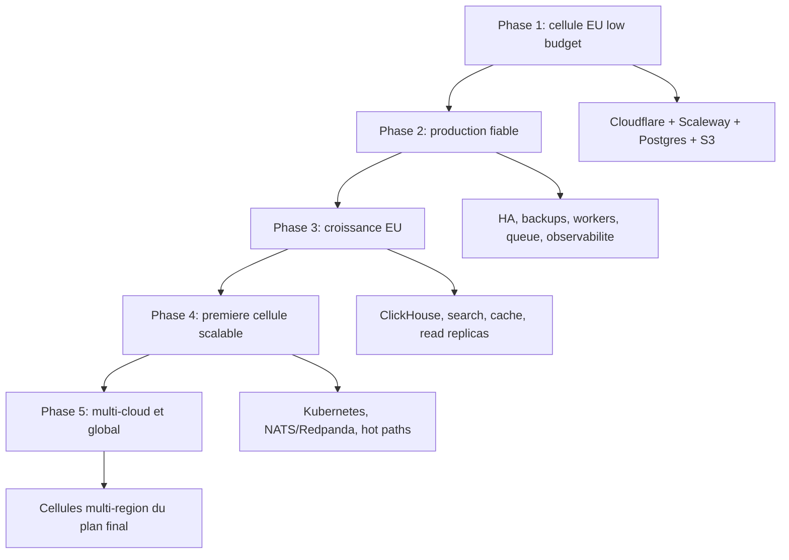

# Plan Starter Low Budget vers Plateforme Globale

## Statut

**Exploration long terme, non roadmap V1.** Pour la V1, le contrat exécutable
20/30 EUR TTC, le scale-to-zero et le traitement manuel prévalent sur toutes les
phases d'upgrade décrites ici. Aucun composant payant ou permanent de ce plan ne
peut être ajouté sans seuil mesuré et décision FinOps. Voir la
[direction produit](../product/nvbes-product-strategy.md).

## Objectif

Demarrer nvbes avec une architecture peu couteuse, exploitable par une petite equipe, mais concue pour evoluer progressivement vers le [Plan Plateforme Globale - Stack Zero](nvbes-global-platform-zero-stack.plan.md).

Ce plan ne cherche pas a simuler l'hyperscale des le debut. Il cherche a eviter les choix qui bloquent l'hyperscale plus tard.

## Principe Central

Demarrer simple, mais figer les bons contrats techniques.

Les composants peuvent etre remplaces plus tard si les interfaces restent stables:

- API SQL standard pour les donnees transactionnelles;
- API S3-compatible pour les fichiers et artefacts;
- enveloppe d'evenements versionnee;
- `tenant_id`, `region_id` et `data_residency` dans les donnees critiques;
- auth, audit, billing, quotas et observabilite comme primitives de plateforme;
- infrastructure decrite en IaC;
- aucune dependance business directe a une API cloud proprietaire.

## Stack Starter Recommandee

### Edge

- Cloudflare pour DNS, TLS, WAF, CDN, rate limiting et protection basique.
- Cloudflare Workers seulement pour logique edge simple: redirects, headers, preflight, link marketing, cache control.
- Pas de multi-CDN au depart.

Upgrade: Cloudflare Enterprise, bot management avance, load balancing global, Magic Transit ou second edge provider.

### Compute

- Une cellule EU unique.
- Scaleway Instances ou Scaleway Serverless Containers selon le profil de charge.
- Deux processus applicatifs minimum quand le produit devient payant: API et worker.
- Load balancer devant l'API des que le trafic est public.
- Pas de Kubernetes au depart.

Upgrade: plusieurs instances derriere load balancer, containers versionnes, puis Kubernetes seulement quand le nombre de services, workers ou besoins d'autoscaling le justifie.

### Donnees Transactionnelles

- PostgreSQL manage comme source de verite initiale.
- Schemas separes par domaine ou prefixage clair des tables.
- `tenant_id`, `region_id`, `created_at`, `updated_at` et audit metadata sur les tables critiques.
- Read replicas seulement quand les lectures deviennent un probleme mesure.

Upgrade: partitionnement Postgres par tenant/date/produit, extraction de domaines, CockroachDB/YugabyteDB quand le multi-region actif devient un vrai besoin, ScyllaDB seulement pour hot paths massifs non relationnels.

### Cache et Sessions

- Redis/Valkey manage si disponible dans la region cible.
- Upstash Redis peut etre utilise pour demarrer serverless ou edge-friendly si le cout operationnel prime.
- Cache, sessions courtes, rate limits et locks legers uniquement.

Upgrade: Redis/Valkey Cluster, DragonflyDB si le debit in-memory devient une contrainte, caches regionaux par cellule dans le plan final.

### Object Storage

- Scaleway Object Storage S3-compatible pour fichiers utilisateurs, exports, media et artefacts.
- Presigned URLs pour upload/download.
- Object keys opaques, jamais derives des noms utilisateur.
- Lifecycle rules pour uploads temporaires, exports expires et logs froids.

Upgrade: Cloudflare R2 pour distribution edge ou egress, replication vers second provider, Ceph ou MinIO seulement si le volume justifie du self-managed.

### Jobs et Events

- Outbox transactionnelle dans PostgreSQL pour garantir qu'un changement business et son evenement sont atomiques.
- Worker publisher qui envoie vers une queue durable.
- Queue simple au depart: Cloudflare Queues, Scaleway Queues/RabbitMQ ou NATS single-region selon les besoins.
- DLQ, retries, backoff et idempotency key des le premier workflow critique.

Upgrade: NATS pour control plane et realtime, Redpanda/Kafka pour event log durable, Flink quand les traitements streaming deviennent critiques.

### Analytics

- Ne pas installer un data lake au depart.
- Logger des evenements structures avec `tenant_id`, `product`, `feature`, `region`, `request_id` et `cost_unit`.
- Demarrer avec exports object storage + requetes ponctuelles ou base analytique legere.
- Ajouter ClickHouse des que les events, logs ou dashboards ralentissent PostgreSQL.

Upgrade: ClickHouse pour analytics temps reel, Iceberg sur object storage pour historique long terme, DaaS et Public Data, Trino pour exploration lakehouse.

### Search et IA

- PostgreSQL full-text search et indexes trigram au depart.
- pgvector seulement si une feature IA simple en a besoin.
- Pas d'OpenSearch ni vector DB dediee avant volume ou latence mesuree.

Upgrade: OpenSearch/Elasticsearch pour mail, drive, audit et recherche documents, Qdrant/Milvus/Weaviate pour vector search dedie.

### Observabilite

- Logs structures JSON des le jour 1.
- Sentry ou equivalent pour erreurs applicatives.
- OpenTelemetry dans le code meme si le backend collector reste simple.
- Dashboards minimum: disponibilite API, latence p95/p99, erreurs, jobs, DB, stockage, cout par tenant.

Upgrade: Prometheus/Grafana/Mimir, ClickHouse pour logs haut volume, SLO par produit, region et tenant.

## Phases

## Phase 1 - Bootstrap Low Budget

Objectif: lancer vite sans dette d'architecture.

Stack:

- Cloudflare DNS/TLS/WAF/CDN.
- Scaleway region EU unique.
- 1 API + 1 worker.
- PostgreSQL manage.
- Object Storage S3-compatible.
- Redis/Valkey ou Upstash si besoin de cache/session.
- outbox + queue simple.
- backups automatiques + test manuel de restauration.

Produits adaptes: Identity Center minimal, Drive minimal, Link marketing, Forms, Tasks, Boards simples, Site statique ou semi-statique.

Produits a eviter: Meet grande echelle, video editor lourd, PaaS/FaaS executeur de code utilisateur, Wallet critique, Identity Verifier complet.

## Phase 2 - Production Fiable

Objectif: etre vendable sans sur-ingenierie.

Ajouter:

- load balancer;
- deux instances API si le produit devient payant;
- workers separes par criticite;
- queue avec DLQ et retry policy;
- secret manager ou gestion de secrets stricte;
- alerting et runbooks;
- budget alerts cloud;
- CI/CD avec artefacts immuables;
- backups testes avec RPO/RTO documentes.

Decision importante: rester sur PostgreSQL tant que les problemes sont resolvables par indexes, pooler, replicas, partitionnement ou optimisation.

## Phase 3 - Croissance EU

Objectif: retirer les charges lourdes de PostgreSQL.

Ajouter seulement si les metriques le demandent:

- ClickHouse pour logs, events produit, analytics et bot signals;
- OpenSearch pour recherche document/mail;
- read replicas PostgreSQL;
- Redis/Valkey dedie pour rate limit, sessions et cache;
- NATS pour presence ou realtime faible latence;
- R2 ou CDN avance pour assets et downloads publics.

Premieres extractions possibles:

- service media;
- service search;
- service analytics;
- service notifications;
- realtime gateway.

## Phase 4 - Premiere Cellule Scalable

Objectif: preparer la forme du plan final sans passer global trop tot.

Ajouter:

- Kubernetes dans une seule region EU si le nombre de services le justifie;
- Cilium pour network policies et observabilite reseau;
- Envoy Gateway;
- separation node pools API, workers, realtime, media;
- Redpanda/Kafka pour event log durable;
- ScyllaDB pour chat, timelines ou bot features si le volume le justifie;
- pgvector vers Qdrant/Milvus si la recherche vectorielle sort de PostgreSQL.

Regle: Kubernetes arrive quand il retire une douleur operationnelle reelle. Il ne doit pas etre le point de depart.

## Phase 5 - Multi-Cloud Progressif

Objectif: resilier les risques fournisseur sans payer l'active-active global inutilement.

Ordre recommande:

1. backups offsite vers second provider;
2. object storage replique ou exporte;
3. Terraform modules provider-agnostic quand possible;
4. registry OCI replique;
5. environnement warm standby sur second cloud;
6. interconnexion privee dediee quand le trafic cross-cloud justifie le cout;
7. cellules US/APAC seulement quand la latence, la residence des donnees ou les ventes l'exigent.

Le multi-cloud actif ne doit pas etre achete avant d'avoir:

- revenus suffisants;
- besoin client clair;
- runbooks de failover testes;
- observabilite cross-cloud;
- modele de cout egress compris.

## Matrice d'Upgrade

| Starter | Upgrade intermediaire | Plan final |
|---|---|---|
| Cloudflare basique | Cloudflare paid + LB | Cloudflare Enterprise + multi-CDN |
| 1 region Scaleway | Scaleway HA + standby cloud | cellules multi-cloud |
| Instances/containers | plusieurs nodes + LB | Kubernetes par cellule |
| PostgreSQL manage | replicas + partitions | CockroachDB/YugabyteDB par besoin |
| Postgres hot path | table dediee + cache | ScyllaDB |
| Redis/Valkey simple | cluster regional | cache par cellule |
| Object Storage Scaleway | R2/replication second provider | S3/R2/Ceph multi-region |
| outbox + queue simple | NATS ou RabbitMQ | Kafka/Redpanda + Flink |
| Postgres analytics | ClickHouse | ClickHouse + Iceberg + Trino |
| Postgres FTS | OpenSearch single region | OpenSearch multi-region |
| pgvector | Qdrant single region | vector stores par cellule |

## Signaux de Passage

Ajouter une brique seulement quand un signal est observe:

- PostgreSQL CPU, locks, connexions ou p95 requetes deviennent un risque recurrent.
- Les dashboards ou analytics ralentissent les transactions.
- Les fichiers/media dominent les couts ou la latence.
- Les jobs critiques prennent du retard ou perdent en fiabilite.
- Les recherches full-text deviennent lentes ou trop complexes.
- Le realtime ne tient plus dans une seule cellule.
- Un client impose residence des donnees, haute dispo ou region dediee.
- Le cout d'une panne depasse le cout d'une brique d'infra supplementaire.

## Non-Negociables Des Le Depart

- `tenant_id` partout ou une donnees appartient a un client.
- `region_id` ou `data_residency` sur les donnees sensibles.
- audit append-only pour auth, billing, permissions, KYC, wallet et admin.
- idempotency keys pour paiements, webhooks, jobs et mutations critiques.
- object keys opaques.
- contrats d'evenements versionnes.
- migration SQL versionnee.
- backups chiffres et restauration testee.
- separation stricte entre secrets, config et code.
- budget alerts par environnement.

## Ce Qu'il Ne Faut Pas Acheter Trop Tot

- Kubernetes avant plusieurs services ou un vrai besoin d'autoscaling.
- Kafka/Redpanda avant un vrai volume event-driven.
- ScyllaDB avant un hot path massif clairement identifie.
- ClickHouse avant que l'analytics gene PostgreSQL.
- OpenSearch avant que PostgreSQL full-text ne soit insuffisant.
- multi-cloud actif avant revenus, runbooks et besoin client.
- service mesh global avant besoin mTLS/policy/service-to-service clair.

## Critere de Reussite

Le plan starter est reussi si:

- la facture reste faible au lancement;
- l'architecture reste comprehensible par une petite equipe;
- les donnees sont deja taggees pour tenant, region et audit;
- les fichiers passent par une API S3-compatible;
- les evenements critiques peuvent etre rejoues;
- chaque brique a un chemin clair vers la cible finale;
- aucune migration future ne demande de reecrire tout le produit.

## Sources Publiques Consultees

- [Scaleway Instances](https://www.scaleway.com/en/docs/instances/)
- [Scaleway Managed Database for PostgreSQL and MySQL](https://www.scaleway.com/en/docs/managed-databases-for-postgresql-and-mysql/)
- [Scaleway Object Storage](https://www.scaleway.com/en/docs/object-storage/)
- [Scaleway Serverless Containers](https://www.scaleway.com/en/docs/serverless-containers/)
- [Scaleway Queues](https://www.scaleway.com/en/docs/queues/reference-content/queues-overview/)
- [Scaleway NATS](https://www.scaleway.com/en/docs/nats/)
- [Scaleway RabbitMQ](https://www.scaleway.com/en/docs/rabbitmq/)
- [Cloudflare Workers](https://developers.cloudflare.com/workers/)
- [Cloudflare R2](https://developers.cloudflare.com/r2/)
- [Cloudflare Queues](https://developers.cloudflare.com/queues/)
- [Upstash Redis](https://upstash.com/docs/redis/overall/getstarted)
