## Graphe de Dépendances Rust (Crates & Services)

Le diagramme ci-dessous illustre les liaisons déterministes entre les services applicatifs et les primitives partagées.

```mermaid
flowchart TD
    subgraph Applications ["Services & Workers"]
        nvbes_account_service["nvbes-account-service"]
        nvbes_billing_service["nvbes-billing-service"]
        nvbes_email_worker["nvbes-email-worker"]
        nvbes_identity_service["nvbes-identity-service"]
        nvbes_trust_risk_service["nvbes-trust-risk-service"]
    end

    subgraph Libraries ["Bibliotheques Partagees"]
        nvbes_email_scaleway["nvbes-email-scaleway"]
        nvbes_audit["nvbes-audit"]
        nvbes_billing["nvbes-billing"]
        nvbes_core["nvbes-core"]
        nvbes_email["nvbes-email"]
        nvbes_observability["nvbes-observability"]
        nvbes_platform["nvbes-platform"]
        nvbes_region["nvbes-region"]
        nvbes_test_utils["nvbes-test-utils"]
        nvbes_trust_risk["nvbes-trust-risk"]
    end

    nvbes_account_service --> nvbes_observability
    nvbes_billing_service --> nvbes_billing
    nvbes_billing_service --> nvbes_core
    nvbes_billing_service --> nvbes_observability
    nvbes_email_worker --> nvbes_core
    nvbes_email_worker --> nvbes_email
    nvbes_email_worker --> nvbes_email_scaleway
    nvbes_email_worker --> nvbes_observability
    nvbes_identity_service --> nvbes_core
    nvbes_identity_service --> nvbes_email
    nvbes_identity_service --> nvbes_observability
    nvbes_trust_risk_service --> nvbes_core
    nvbes_trust_risk_service --> nvbes_observability
    nvbes_trust_risk_service --> nvbes_trust_risk
    nvbes_trust_risk_service --> opentelemetry_otlp
```

## Règles d'Isolation des Domaines (Boundaries)

- **Isolation stricte** : Aucun service d'un domaine (ex: `identity`) ne peut importer directement la base de données d'un autre domaine (ex: `cloud`).
- **Communication inter-services** : Réalisée exclusivement via des contrats HTTP / OpenAPI typés ou des queues asynchrones.
- **Lib Core** : `libs/rust/core` doit rester neutre et sans logique métier spécifique.
