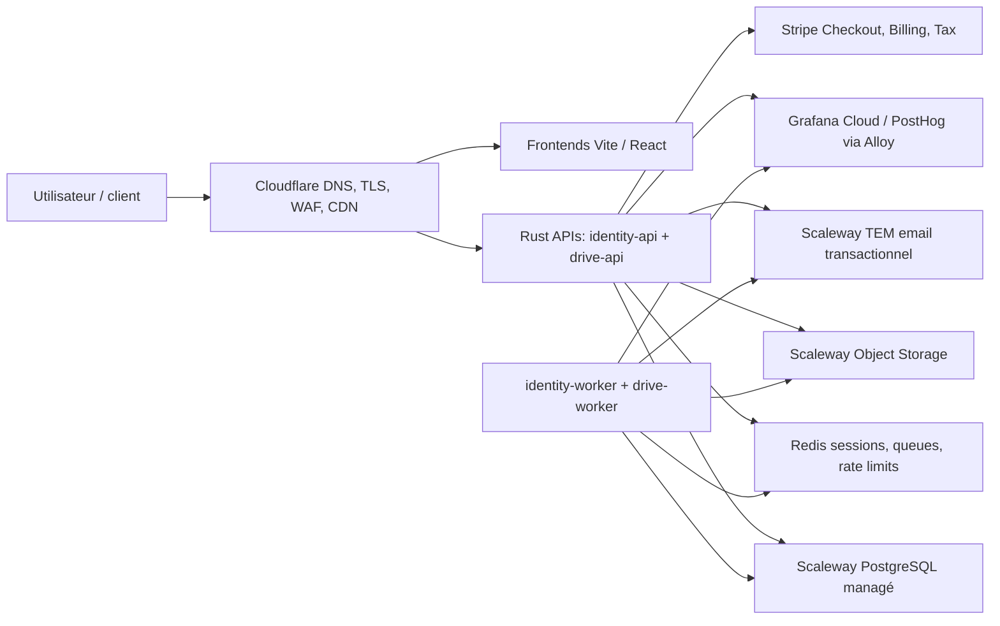

# Audit FinOps: trajectoire production à coût fixe quasi nul

Date: 2026-06-06

## Résumé exécutif

L'objectif "0 EUR de coût de production" doit être reformulé en deux objectifs distincts:

1. **0 EUR de coût fixe avant traction payante**: atteignable uniquement si la production V0 tourne sur des free tiers, des crédits fournisseur, ou une architecture serverless compatible free tier.
2. **0 EUR de perte de production**: atteignable et préférable. Chaque client doit financer ses coûts variables directs dès le premier mois, avec garde-fous de quotas, d'egress, de logs et de support.

Avec l'architecture actuellement documentée et l'IaC existante, un vrai coût fixe à 0 EUR n'est pas atteignable:

- `infrastructure/modules/scaleway-v1` provisionne deux instances Scaleway, une pour l'API et une pour le worker.
- PostgreSQL est managé chez Scaleway.
- Object Storage, backups, IP publiques, observabilité et email sont des centres de coûts réels.
- Le backend Rust/Axum + SQLx + PostgreSQL ne se déploie pas tel quel sur Cloudflare Workers Free.

La trajectoire recommandée est donc:

- **Court terme beta**: viser un coût fixe mensuel inférieur à 25 EUR HT, pas 0 EUR, sans dette d'exploitation dangereuse.
- **Avant lancement payant**: corriger la matrice plans/prix/quotas, aujourd'hui incohérente entre docs, migrations Drive et Identity.
- **Lancement public**: viser une marge brute minimale de 70% par plan mature et bloquer toute offre dont un heavy user peut rendre la marge négative.

## Sources tarifaires utilisées

Tarifs consultés le 2026-06-06. Les prix fournisseurs changent: cette section doit être revalidée avant toute mise en production payante.

- Scaleway Virtual Instances: DEV1-S environ 6,42 EUR/mois, DEV1-M environ 14,45 EUR/mois, Flexible IP environ 0,004 EUR/heure. Source: https://www.scaleway.com/en/pricing/virtual-instances/
- Scaleway Managed Databases: DB-DEV-S 0,0156 EUR/heure, Block Storage 5K 0,0993 EUR/GB/mois, backups/snapshots 0,03 EUR/GB/mois. Source: https://www.scaleway.com/en/pricing/managed-databases/
- Scaleway Object Storage Paris: Standard One Zone 0,00752 EUR/GB/mois, Standard Multi-AZ 0,01460 EUR/GB/mois, 75 GB d'egress inclus puis 0,01 EUR/GB. Source: https://www.scaleway.com/fr/tarifs/storage/
- Scaleway Transactional Email: Essential 300 emails inclus puis 0,25 EUR / 1000 emails, Scale 80 EUR/mois. Source: https://www.scaleway.com/en/pricing/managed-services/
- Stripe France: cartes EEE standard 1,5% + 0,25 EUR, cartes UK 2,5% + 0,25 EUR, Checkout inclus avec Payments, domaine custom Checkout 10 USD/mois, post-payment invoice 0,4% plafonné à 2 USD. Source: https://stripe.com/en-fr/pricing
- Cloudflare: plan Free à 0 USD/mois, Workers Free 100 000 requêtes/jour, Workers Paid 5 USD/mois minimum, R2 Free 10 GB-month. Source: https://developers.cloudflare.com/workers/platform/pricing/ et https://www.cloudflare.com/plans/
- Grafana Cloud: Free avec 10k séries métriques, 50 GB logs, 50 GB traces/profiles et 14 jours de rétention. Source: https://grafana.com/pricing/
- PostHog Cloud: Free avec 1M events analytics, 50 GB logs, 1 projet et région EU Frankfurt disponible. Source: https://posthog.com/pricing

## Architecture actuelle des coûts



Centres de coûts:

| Centre | Type | Déclencheur | Risque FinOps |
| --- | --- | --- | --- |
| Compute API | Fixe | instance API | coût mensuel même sans client |
| Compute worker | Fixe | instance worker séparée | coût fixe doublé au démarrage |
| PostgreSQL | Fixe + stockage | DB managée, volume, backups | coût incompressible si managé |
| Redis | Fixe si managé | sessions, queues, locks | non présent dans l'IaC actuel, mais requis par le code |
| Object Storage | Variable | GB stockés, egress, lifecycle, versioning | peut exploser avec plans généreux |
| Backups | Variable | volume DB + rétention | coût faible au départ mais obligatoire |
| Observabilité | Variable | logs, traces, profiles, séries | la production peut dépasser les free tiers par logs |
| Email | Variable | vérification, reset, export, billing | faible en beta, réputation plus critique que coût |
| Stripe | Variable | paiement réussi, invoice, Tax éventuel | impact fort sur Solo Pro à 15 EUR |
| Support | Variable humain | tickets, incidents, onboarding | non facturé par fournisseur mais réel |

## Estimation du socle actuel

Ces estimations sont HT, hors crédits, hors TVA, hors support humain, et basées sur 730 heures/mois.

### Development IaC

Ressources définies dans `infrastructure/environments/development/main.tf`:

- API `DEV1-S`: ~6,42 EUR/mois.
- Worker `DEV1-S`: ~6,42 EUR/mois.
- PostgreSQL `DB-DEV-S`: ~11,39 EUR/mois.
- Volume PostgreSQL 10 GB: ~0,99 EUR/mois.
- Backups PostgreSQL, hypothèse 10 GB: ~0,30 EUR/mois.
- Deux IP publiques, hypothèse Flexible IP facturée: ~5,84 EUR/mois.

Estimation: **~29 à 32 EUR/mois** avant object storage, logs, email et trafic.

### Staging IaC

Ressources définies dans `infrastructure/environments/staging/main.tf`:

- API `DEV1-M`: ~14,45 EUR/mois.
- Worker `DEV1-S`: ~6,42 EUR/mois.
- PostgreSQL `DB-DEV-S`: ~11,39 EUR/mois.
- Volume PostgreSQL 10 GB: ~0,99 EUR/mois.
- Backups PostgreSQL, hypothèse 10 GB: ~0,30 EUR/mois.
- Deux IP publiques, hypothèse Flexible IP facturée: ~5,84 EUR/mois.

Estimation: **~37 à 40 EUR/mois** avant object storage, logs, email et trafic.

### Production

`infrastructure/environments/production` porte l'observabilité, pas un overlay Terraform complet. Si la production reprend le modèle staging, le coût fixe minimal sera au moins du même ordre, probablement supérieur si l'on ajoute Redis managé, HA, load balancer, rétention logs et backups renforcés.

## Verdict "0 EUR production"

| Scénario | Coût fixe | Compatibilité code actuel | Risque |
| --- | ---: | --- | --- |
| IaC Scaleway actuel | Non nul | forte | robuste mais payant |
| Une seule VM API + workers + Redis local + PostgreSQL managé | faible | forte | bon compromis beta |
| Une seule VM avec PostgreSQL + Redis autohébergés | très faible | forte | dette ops si backups/restore non bétonnés |
| Cloudflare Pages + Workers Free + D1/R2 | quasi nul au début | faible | nécessite redesign backend TypeScript/serverless |
| Free tiers externes PostgreSQL + Cloudflare | quasi nul au début | moyen | souveraineté, limites, wake-up, migration à prévoir |
| Crédits fournisseur | 0 EUR cash temporaire | forte | pas un modèle économique |

Conclusion: **0 EUR fixe est incompatible avec le backend Rust/PostgreSQL/Scaleway managé actuel sans crédits ou redesign profond.** L'objectif sain est un socle fixe minimal et une marge client positive dès l'activation.

## Incohérences critiques plans/prix/quotas

### Documentation commerciale

`docs/product/pricing.md` annonce:

| Plan | Prix | Utilisateurs | Stockage | Rétention |
| --- | ---: | ---: | ---: | ---: |
| Solo Pro | 15 EUR/mois | 1 | 1 To | 90 jours |
| Team | 39 EUR/mois | 3 | 2 To | 180 jours |
| Team Plus | 79 EUR/mois | 8 | 5 To | 180 jours |

### Code et migrations

Constantes billing dans `libs/rust/billing/src/shared.rs`:

- `solo_pro`: 15 EUR/mois.
- `team`: 39 EUR/mois.
- `team_plus`: 79 EUR/mois.
- stockage additionnel: 0,04 EUR/GB/mois.
- siège additionnel: 9 EUR/mois.

Migrations Drive dans `apps/drive-api/migrations/0001_initial_schema.sql`:

| Plan | Stockage | Utilisateurs | Rétention | Liens |
| --- | ---: | ---: | ---: | ---: |
| trial | 5 GB | 1 | 30 jours | 25 |
| solo_pro | 100 GB | 1 | 30 jours | 100 |
| team | 1000 GB | 10 | 90 jours | 1000 |
| team_plus | 5000 GB | 25 | 365 jours | 5000 |

Migrations Identity dans `apps/identity-api/migrations/0001_initial_schema.sql`:

- Les plans `trial`, `solo_pro`, `team`, `team_plus` existent.
- Les colonnes `included_storage_gb`, `included_users`, `retention_days`, `max_share_links`, `audit_level` sont ajoutées plus tard avec défaut `0`.
- Aucune mise à jour visible ne renseigne les quotas complets dans Identity.

Impact:

- Le pricing public, les droits Drive et la vue billing Identity peuvent diverger.
- Un client peut voir un quota commercial différent du quota réellement appliqué.
- Les marges calculées sur la documentation peuvent être fausses.
- Le plan Solo Pro est économiquement dangereux si 1 To inclus est réellement vendu à 15 EUR/mois.

Action obligatoire avant lancement payant:

- Créer une unique matrice canonique plans/prix/quotas.
- Seeder cette matrice dans Identity et Drive.
- Générer ou tester les vues billing depuis cette matrice.
- Ajouter un check qui échoue si docs, seeds et constantes divergent.

## Économie unitaire par plan

Hypothèses:

- Stockage Scaleway Standard One Zone: 0,00752 EUR/GB/mois.
- Variante plus robuste Multi-AZ: 0,01460 EUR/GB/mois.
- Egress public: 75 GB inclus par mois puis 0,01 EUR/GB.
- Stripe carte EEE standard: 1,5% + 0,25 EUR.
- Les coûts fixes de plateforme ne sont pas répartis ici; ils doivent être couverts par le MRR global.

### Si l'offre documentaire actuelle est appliquée

| Plan | Prix | Stockage inclus | Coût One Zone si plein | Coût Multi-AZ si plein | Frais Stripe EEE | Marge brute avant egress/support |
| --- | ---: | ---: | ---: | ---: | ---: | ---: |
| Solo Pro | 15 EUR | 1000 GB | 7,52 EUR | 14,60 EUR | 0,48 EUR | ~46,7% One Zone, négatif/fragile Multi-AZ |
| Team | 39 EUR | 2000 GB | 15,04 EUR | 29,20 EUR | 0,84 EUR | ~59,4% One Zone, ~25,5% Multi-AZ |
| Team Plus | 79 EUR | 5000 GB | 37,60 EUR | 73,00 EUR | 1,44 EUR | ~52,0% One Zone, ~6,8% Multi-AZ |

Verdict: cette grille ne respecte pas la cible 70% de marge brute si les clients utilisent fortement le stockage inclus. Elle vend trop de stockage pour un positionnement "petite équipe sécurisée", surtout Solo Pro.

### Si les migrations Drive actuelles sont appliquées

| Plan | Prix | Stockage inclus | Coût One Zone si plein | Frais Stripe EEE | Marge brute avant egress/support |
| --- | ---: | ---: | ---: | ---: | ---: |
| Solo Pro | 15 EUR | 100 GB | 0,75 EUR | 0,48 EUR | ~91,8% |
| Team | 39 EUR | 1000 GB | 7,52 EUR | 0,84 EUR | ~78,6% |
| Team Plus | 79 EUR | 5000 GB | 37,60 EUR | 1,44 EUR | ~50,6% |

Verdict: Solo Pro et Team deviennent économiquement sains, Team Plus reste trop généreux si l'usage moyen se rapproche du plafond.

## Recommandation de nouvelles offres V1

Le produit ne doit pas vendre du stockage brut. La promesse doit rester: **drive européen sécurisé pour petites équipes qui partagent des fichiers clients avec contrôle**.

### Grille recommandée

| Plan | Prix recommandé | Stockage inclus | Utilisateurs inclus | Egress inclus | Rétention | Rôle marketing |
| --- | ---: | ---: | ---: | ---: | ---: | --- |
| Trial | 0 EUR | 5 GB | 1 | 5 GB | 7 jours | activation sans risque économique |
| Solo Pro | 19 EUR/mois | 100 GB | 1 | 25 GB | 30 jours | indépendant premium, pas stockage massif |
| Team | 49 EUR/mois | 1 TB | 5 | 100 GB | 90 jours | plan recommandé agences/studios |
| Team Plus | 99 EUR/mois | 2 TB | 10 | 250 GB | 180 jours | équipes plus actives, contrôle et API |
| Business | sur devis | quota négocié | quota négocié | quota négocié | négociée | clients qui exigent SLA/SSO/contrat |

Overages:

- Stockage additionnel: garder 0,04 EUR/GB/mois en V1. Cette marge absorbe stockage, backups, lifecycle, logs, support et imprévus.
- Siège additionnel: 9 EUR/mois reste cohérent.
- Egress: ne pas facturer en V1 sans UX claire, mais appliquer un fair-use et des alertes. Bloquer ou ralentir les liens publics abusifs.

Pourquoi augmenter les prix:

- 15 EUR/mois avec carte Stripe donne environ 14,52 EUR net avant infra et support.
- Une offre "drive européen sécurisé" doit être vendue comme un outil de contrôle, pas comme un disque dur cloud low-cost.
- Les clients ICP agences/studios paient pour éviter les liens oubliés, les fichiers dispersés et la faible visibilité d'exposition.

## Pertinence marketing

### Ce qui est solide

- ICP clair: agences/studios 2 à 10 personnes, clients externes, fichiers sensibles.
- Positionnement différenciant: hébergement européen, liens expirables, vue des liens actifs, rôles, audit, facturation lisible.
- Le produit évite de concurrencer Google Drive sur la bureautique collaborative, ce qui est sain.

### Ce qui doit changer

- "1 To pour 15 EUR" attire des heavy users de stockage, pas forcément des équipes qui valorisent le contrôle.
- "5 To pour 79 EUR" ressemble à une offre de stockage brut et met la marge en risque.
- Le message doit mentionner des limites claires: stockage inclus, egress fair-use, expiration des liens, sécurité des partages.
- L'offre Team doit être la vraie ancre commerciale. Solo doit rester un point d'entrée, pas le meilleur ratio stockage/prix.

### Positionnement recommandé

Message principal:

```text
Le drive européen pour contrôler les fichiers client partagés par votre équipe.
```

Sous-message:

```text
Stockage privé, liens expirables, visibilité des accès et facturation prévisible pour agences, studios et cabinets de conseil.
```

Preuves à prioriser:

- Tous les liens publics expirent.
- Vue centrale des liens actifs.
- Rôles d'équipe simples.
- Données hébergées en Europe.
- Export et suppression des données.
- Quotas et facture estimée visibles avant dépassement.

Ne pas promettre en V1:

- stockage illimité;
- egress illimité;
- SLA enterprise;
- SSO/SAML;
- suite bureautique collaborative;
- conformité SOC 2/ISO tant qu'elle n'est pas obtenue.

## Trajectoire FinOps recommandée

### Phase 0: bêta à coût fixe minimal

Objectif: valider activation et conversion sans architecture coûteuse.

- Garder Cloudflare Free pour DNS/CDN/WAF minimal si les règles utilisées restent incluses.
- Héberger les frontends sur Cloudflare Pages ou équivalent free tier.
- Fusionner API et workers sur une seule petite instance pour beta si la charge le permet.
- Garder PostgreSQL managé si les tests restore et la sécurité priment sur le coût.
- Ne pas activer Grafana Cloud Pro, PostHog pay-as-you-go, TEM Scale ou Stripe custom domain.
- Mettre un budget fournisseur à 25 EUR/mois en beta interne, puis 50 EUR/mois en beta externe.

### Phase 1: lancement payant sobre

Objectif: marge positive, dette ops basse.

- API et worker séparés seulement si les jobs perturbent la latence API.
- Redis: choisir explicitement entre Redis managé et Redis sur instance. Ne pas laisser un composant requis hors IaC.
- Garder Object Storage One Zone uniquement si le risque de disponibilité est assumé et documenté; sinon réviser les prix pour Multi-AZ.
- Versioning object storage: désactivé ou limité par lifecycle si la promesse produit ne le vend pas explicitement.
- Logs: sampling, drop des payloads volumineux, rétention 14 jours en beta.
- Traces/profiles: sampling agressif, activation temporaire lors d'incidents.

### Phase 2: production stable

Objectif: ne jamais subventionner un client abusif.

- Tableau FinOps hebdomadaire: coût par workspace, plan, GB stocké, GB egress, volume logs, marge brute.
- Alertes à 80% et 100% de budget fournisseur.
- Alertes workspace à marge négative.
- Alertes egress anormal et liens publics trop actifs.
- Revue mensuelle pricing/quotas.
- Migration vers ressources plus robustes uniquement quand le MRR finance le palier.

## Garde-fous produit obligatoires

- Trial 14 jours, 5 GB, egress limité, upload rate limit, liens publics limités.
- Aucun lien public sans expiration.
- Blocage des nouveaux uploads après dépassement critique de quota.
- Estimation de facture visible avant tout usage facturé.
- Notifications client à 80%, 100% et dépassement.
- Cap de dépense interne par workspace.
- Kill switch de partage public par workspace en cas d'abus.
- Lifecycle strict pour uploads incomplets, corbeille, trials expirés et quarantaines.
- Pas de `SCAN_FAIL_OPEN=true` en production si l'anti-malware est vendu comme preuve de sécurité.

## KPIs FinOps

| KPI | Définition | Cible V1 |
| --- | --- | --- |
| Coût fixe plateforme | compute + DB + Redis + observabilité hors usage client | < 50 EUR/mois avant clients payants |
| Coût par workspace actif | coûts variables + quote-part fixe | décroissant par cohorte |
| Coût par TB stocké | object storage + backups + lifecycle | suivi mensuel |
| Marge brute par plan | revenu HT - coûts directs / revenu HT | 70% mature, 50% lancement |
| Egress par workspace | GB sortants mensuels | alerte au-dessus du fair-use |
| Logs par workspace | volume logs imputable | pas de croissance non bornée |
| Trial burn | coût moyen par trial | < 0,50 EUR/trial |
| CAC payback | CAC / marge brute mensuelle | à mesurer après premières ventes |

## Backlog priorisé

### P0 avant tout lancement payant

- Unifier la matrice plans/prix/quotas entre documentation, migrations Drive, migrations Identity et constantes billing.
- Ajouter une migration Identity qui renseigne `included_storage_gb`, `included_users`, `retention_days`, `max_share_links`, `audit_level`.
- Ajouter un test ou script de vérification qui compare la matrice canonique aux plans exposés par les APIs.
- Décider One Zone vs Multi-AZ pour Object Storage et recalculer les prix.
- Ajouter un budget cloud et des alertes 80%/100%.
- Mettre Redis dans l'IaC ou documenter explicitement son mode d'exploitation production.

### P1 avant beta externe

- Réduire le coût fixe beta: un seul worker host ou colocalisation API/worker si acceptable.
- Ajouter des caps trial: egress, uploads/jour, liens actifs.
- Ajouter les métriques FinOps par workspace.
- Activer sampling logs/traces/profiles par défaut.
- Documenter le runbook "workspace à marge négative".

### P2 avant scale

- Facturation egress ou fair-use contractualisé.
- Lifecycle avancé par plan.
- Negotiation Stripe ou ajout SEPA Direct Debit pour réduire les frais sur plans annuels.
- Plans annuels avec remise modérée, pas agressive, pour financer le socle fixe.
- Business plan sur devis pour volumes stockage/egress non standards.

## Décisions recommandées

1. Ne pas poursuivre un objectif littéral de production à 0 EUR avec l'architecture Scaleway managée actuelle.
2. Viser **0 EUR de perte** plutôt que 0 EUR de facture.
3. Repositionner Solo Pro à 19 EUR / 100 GB ou garder 15 EUR uniquement si le quota reste proche de 100 GB.
4. Repositionner Team à 49 EUR / 1 TB comme plan recommandé.
5. Réduire Team Plus à 2 TB ou augmenter fortement son prix si 5 TB reste inclus.
6. Ne pas vendre le stockage comme promesse principale; vendre le contrôle des partages client.
7. Faire de la matrice plans/prix/quotas une source de vérité testée.
