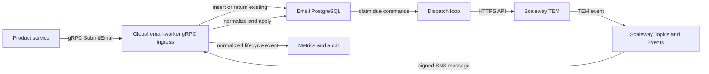

# Global Email Delivery Design

Centralize every transactional email behind one typed Rust client and one global email runtime. Product services only submit durable email commands; the global runtime owns rendering, provider dispatch, retries, delivery state, webhooks, suppressions, and observability.

## Decision

Replace the domain-specific Identity and Billing delivery paths with:

- `nvbes-email`, the provider-neutral package and internal client used by product services;
- one Rust `email-worker` runtime exposing authenticated command ingestion and signed provider webhook endpoints while running the dispatch loop;
- one email-owned PostgreSQL schema containing commands, delivery attempts, provider events, and suppression state;
- Scaleway Transactional Email as the initial production adapter, without the Cloudflare relay;
- mock and filesystem capture adapters restricted to development and tests.

`email.send(command).await` means **the command has been durably accepted by the nvbes email system**. It does not mean that the provider has accepted or delivered the message.

## Goals

- Give every product one small, typed API for transactional email.
- Remove email delivery logic from Identity, Billing, Enterprise, Account, and their workers.
- Keep HTTP request latency and provider outages outside product business flows.
- Guarantee idempotent command acceptance and observable at-least-once provider dispatch.
- Process provider callbacks through one authenticated, idempotent procedure.
- Maintain one canonical template source with HTML and plain-text output.
- Protect deliverability with explicit suppression rules and complete lifecycle tracking.

## Non-goals

This migration does not add marketing campaigns, mailing lists, scheduled newsletters, a preference center, multiple production providers, automatic failover, or a shared product database. It does not claim exactly-once provider delivery, which cannot be guaranteed across the network boundary.

## Architecture

The gRPC ingress, public HTTP webhook ingress, and dispatch loop live in the same deployable initially, but remain separate Rust modules with separate dependency boundaries. This keeps V0 operations simple without coupling their implementations. They can be deployed independently later without changing the client contract or database model.

All nvbes inter-service communication in this email architecture uses gRPC, including product outbox relays. HTTP remains only where imposed by an external integration: Scaleway's REST provider API, Topics and Events webhook delivery, and Load Balancer/container health probes.

## Components

### `libs/rust/email`

The package becomes the only public email boundary. It contains:

- `EmailClient`, an authenticated tonic gRPC client;
- versioned `EmailCommand` and `EmailReceipt` contracts;
- typed recipient, category, template, and idempotency types;
- safe request validation and redacted errors;
- the provider-neutral `EmailProvider` trait used only by the global runtime;
- mock and test-capture implementations.

Product services must not depend on Scaleway, SMTP, template files, email tables, or queue internals.

`EmailCommand` carries a typed idempotency key, recipient, transactional category, template variant, and mandatory `deliver_before` deadline. `EmailReceipt` returns the stable message ID, acceptance time, effective deadline, and whether the command was a duplicate. `TransactionalEmailTemplate` is a closed, versioned enum covering verification, password reset, password-change step-up, account security, billing receipt, billing payment failure, and access-review reminder emails. Arbitrary product-supplied HTML is not accepted.

The wire contract lives in `contracts/protobuf/nvbes/email/v1/email.proto`. `EmailDeliveryService.SubmitEmail` is the only product-facing call. It uses `google.protobuf.Timestamp` for `deliver_before`, follows the repository's generated tonic conventions, and carries the standard request/correlation context. The server authenticates and authorizes the producer with the standard internal-service gRPC boundary.

### `apps/email-worker`

Rebuild the existing TypeScript Cloudflare application as the single Rust email runtime. Its modules have explicit responsibilities:

- command ingress: authentication, validation, idempotent persistence, and response;
- renderer: typed template to validated multipart message;
- dispatcher: due-message claiming, provider call, retry scheduling, and terminal failure;
- webhook ingress: signature verification and event persistence;
- webhook procedure: normalized state transition and suppression update;
- observability: metrics, structured logs, and HTTP health probes compatible with Scaleway and the container runtime.

The runtime must not import Identity or Billing product crates. Product-specific meaning is represented only by stable email categories and template variants.

Its private gRPC surface is intentionally small:

- `SubmitEmail` durably accepts an authenticated command.
- `grpc.health.v1.Health` reports the gRPC server state to internal clients and diagnostics; Scaleway probes do not call it.

Its HTTP surface is reserved for protocols that require HTTP:

- `POST /webhooks/scaleway/topics-and-events` accepts SNS subscription and notification messages;
- `GET /health/live` is the shallow container liveness probe;
- `GET /health/ready` is the Scaleway Load Balancer readiness probe.

The container runtime calls `/health/live`; it returns success while the process and HTTP runtime are alive and never checks external dependencies. The Scaleway Load Balancer calls `/health/ready`; it returns success only when the database schema is current, PostgreSQL is reachable, required KMS/provider configuration is loaded, and the dispatch loop heartbeat is current. It does not call the provider: a Scaleway TEM outage must accumulate durable commands rather than remove a healthy ingress instance from rotation. Both responses are bounded, contain no operational secrets, and `/health/ready` is restricted to the private/LB network path.

### Production provider

The existing Scaleway adapter is retained and completed as the only production provider. The global worker calls Scaleway TEM directly over HTTPS. The Cloudflare email worker and Terraform relay module are removed after cutover.

SMTP is not a production path. Local development uses a mock, test capture, or an explicitly configured local SMTP adapter such as Mailpit. A non-development runtime refuses to start without the Scaleway configuration, sender identity, webhook trust chain, and Topics and Events subscription configuration.

## Command Ingestion

Product services call `EmailClient::send` only after their business transaction commits. The tonic client authenticates with the standard internal-service credential, applies a bounded gRPC deadline, and may retry `Unavailable` transport failures using the same idempotency key.

The email runtime validates and inserts the command in its own transaction. A unique `(producer, idempotency_key)` constraint returns the original receipt for duplicates. Reusing a key with different immutable command content returns `AlreadyExists` and emits a security-relevant error. A missing, malformed, or already elapsed `deliver_before` value returns `InvalidArgument` and is never persisted.

If the email runtime is unavailable, the product operation follows an explicit policy:

- operations whose only purpose is delivery, such as password-reset request or verification resend, return a retryable service-unavailable outcome internally while preserving enumeration-safe public responses where required;
- operations that already committed durable business state record a product-owned retryable integration event using their existing outbox boundary;
- callers never fall back to direct provider delivery.

This avoids a shared database while closing the commit-to-command loss window for business mutations. The standard product outbox is used only when the email is a side effect of an already committed mutation; the global email runtime remains the sole dispatcher.

## Rendering

Templates live in one canonical Rust-owned template module under the email package/runtime boundary. Each template provides:

- a stable template name and explicit version;
- validated input data;
- a subject;
- HTML output with escaped substitutions;
- a hand-authored plain-text alternative;
- preview text;
- exactly one primary purpose and call to action.

Sender name, sender address, reply-to, and allowed headers come from runtime configuration and category policy, never from product payloads. Security tokens may appear only inside generated HTTPS links. Logs, metrics, errors, and webhook details must not contain tokens or full rendered bodies.

The current Rust HTML files and TypeScript JSON-render templates are replaced by this single source. The orphan invitation template is removed until a real invitation producer is designed and wired atomically with its business outbox.

## Dispatch and Reliability

The dispatcher claims due rows with `FOR UPDATE SKIP LOCKED`, assigns a stable RFC 5322 `Message-ID`, records an attempt, and calls the provider outside any long-lived database lock. A lease token prevents another worker from completing the same attempt.

The delivery guarantee is at least once. Every retry reuses the same provider idempotency metadata and RFC 5322 `Message-ID`. Provider acceptance followed by a lost response remains ambiguous and is recorded as such instead of being reported as a definitive failure.

Failures are classified as:

- transient: timeout, rate limit, provider 5xx, or temporary network failure;
- permanent: invalid recipient syntax, rejected sender configuration, invalid template data, or provider 4xx that cannot succeed unchanged;
- ambiguous: the request may have reached the provider but no authoritative result was received.

Transient and ambiguous failures use bounded exponential backoff with jitter, constrained by the message deadline. Each category defines a maximum attempt count and backoff sequence rather than inheriting a global five-attempt/24-hour rule. Exhausting the attempt count produces terminal `failed`, even before the deadline. Before every claim and before every provider call, the dispatcher compares database time with `deliver_before`. If the deadline has elapsed before provider acceptance, it atomically marks the message `expired` and performs no provider call. It schedules another attempt only when the computed attempt time is strictly earlier than `deliver_before`; otherwise it marks the message `expired` immediately. Permanent failures go directly to terminal `failed`.

For verification-code email, `deliver_before` must equal the authoritative code expiration timestamp, for example 15 minutes after issuance. Password-reset and verification-link messages use their token expiration timestamp. Long-lived receipts and security notices receive an explicit category policy deadline. The runtime validates that a producer cannot extend a credential-bearing email beyond the credential's template policy maximum.

Once the provider has accepted a message, later token expiry does not rewrite the delivery status to `expired`: the email was sent, although its embedded credential may subsequently be invalid. The deadline prevents stale dispatch and retries; it cannot retract an email already accepted by the provider.

## Delivery State Model

The canonical states are:

- `accepted`: durably stored;
- `dispatching`: leased by a dispatcher;
- `provider_accepted`: provider returned an identifier;
- `delivered`: provider confirmed delivery;
- `deferred`: provider reported a temporary delivery delay;
- `hard_bounced`: address cannot receive mail;
- `complained`: recipient reported spam;
- `unsubscribed`: recipient opted out of optional mail;
- `suppressed`: policy prevented provider dispatch;
- `expired`: the delivery deadline elapsed before provider acceptance;
- `dropped`: provider refused or discarded the message;
- `failed`: local permanent failure or exhausted retry budget.

Every transition is validated by one state-machine function. Out-of-order webhooks are accepted when they increase knowledge, while transitions that would regress a terminal state are retained as events without changing the message state.

## Webhook Procedure

Scaleway TEM publishes webhook events through Scaleway Topics and Events rather than calling the runtime directly. The endpoint implements the Topics and Events SNS-compatible subscription-confirmation flow and notification contract.

For each notification, the public provider endpoint performs, in order:

1. enforce method, content type, body-size, and timestamp limits;
2. allow only HTTPS signing-certificate URLs under the documented Scaleway messaging origin;
3. validate the signing certificate against Scaleway's long-lived `fr-par` SNS CA trust chain, supporting certificate rotation and caching by certificate URL;
4. verify the SNS canonical-message signature before parsing the embedded TEM event;
5. reject stale requests and replayed SNS message identifiers;
6. normalize the embedded TEM payload to `EmailProviderEvent`;
7. insert the event using the provider event ID as a unique key;
8. locate the message by provider ID or stable message metadata;
9. apply the state transition and suppression policy in the same transaction;
10. return success for already-processed duplicate events.

Unknown event types are stored with a bounded redacted payload and counted, but do not mutate delivery state.

## Suppression Policy

Suppressions are global because sender reputation is global. Lookup uses a keyed HMAC of the normalized address; the normalized address itself is envelope-encrypted with a dedicated email KMS key so an authorized delivery process can recover it without exposing it in indexes or logs.

- hard bounce and spam complaint block every category, including security messages;
- unsubscribe blocks only optional transactional categories such as reminders;
- a soft bounce increments a rolling counter and becomes a hard suppression only after the configured threshold;
- successful delivery does not automatically remove a suppression;
- removing a hard suppression requires an audited administrative procedure or a verified address change.

Product services do not query suppression state. The global runtime accepts the command and records a terminal `suppressed` outcome so producers receive a stable receipt without learning global deliverability details synchronously.

## Storage

The email-owned schema contains four focused tables:

- `email_messages`: immutable command identity, template version, category, recipient identity, `deliver_before`, current state, and retention timestamps;
- `email_delivery_attempts`: one row per provider attempt, failure classification, lease identity, and provider result;
- `email_provider_events`: deduplicated normalized webhook events and processing result;
- `email_suppressions`: global suppression reason, provenance, policy scope, and audited release metadata.

Rendered bodies and secret-bearing template data are encrypted at rest and deleted after the operational retention window. Long-lived analytics retain only category, template version, outcome, provider, timestamps, and a salted recipient hash. Raw webhook bodies are not retained unless a bounded redacted diagnostic payload is required.

## Observability

The runtime emits and owns:

- accepted commands by producer, category, and template version;
- queue depth and oldest accepted age;
- provider latency and outcome;
- attempts and exhausted deliveries;
- expired messages by producer, category, template version, and age at expiration;
- webhook signature failures, duplicates, unknown types, and processing latency;
- delivery, bounce, complaint, drop, and suppression rates.

Alerts cover oldest-message age, provider error rate, dead letters, hard-bounce rate, complaint rate, and webhook silence. Logs use message IDs and trace IDs, never recipient addresses, tokens, subjects with user data, or rendered bodies.

## Security

- Command ingress is internal-only and requires service authentication plus producer authorization.
- Webhooks require SNS canonical-message signature verification, a CA-validated rotating signing certificate, timestamp freshness, replay protection, and strict schemas.
- Provider secrets come from the existing secret manager and are never available to product services.
- Only the email runtime can access the email database and provider credentials.
- All external provider calls require HTTPS with bounded timeouts and redacted errors.
- Templates cannot set protected headers such as `From`, `Bcc`, `Message-ID`, or unsubscribe headers.

SPF, DKIM, and DMARC remain infrastructure requirements for the configured sender domain and must be verified as a release gate rather than inferred from application health.

## Migration

The migration is incremental and has one cutover owner:

1. introduce the email protobuf contract, schema, internal gRPC command service, dispatcher, HTTP webhook endpoint, and Scaleway adapter tests;
2. add typed templates and compatibility mapping for every currently produced business type;
3. migrate Identity producers to `EmailClient` and remove email queues from `identity-worker`;
4. migrate Billing producers and remove email handling from `billing-worker`;
5. migrate Enterprise access-review reminders and any invitation producer;
6. run shadow comparison on rendered output and command counts without double dispatch;
7. create the Scaleway Topics and Events topic/subscription, confirm it through the global endpoint, route TEM events to it, and verify lifecycle transitions;
8. cut over production dispatch;
9. remove the TypeScript Cloudflare worker, Cloudflare pipeline Terraform, duplicate templates, product email tables, and unused delivery code.

Historical product email records are migrated into the global ledger only when required for active delivery, suppression, audit, or retention obligations. Otherwise they remain read-only until their retention window expires.

## Error Handling Contract

The client exposes a small stable error taxonomy:

- `InvalidCommand`: caller bug, never retry unchanged;
- `Conflict`: idempotency key reused with different content;
- `Unavailable`: email runtime could not durably accept the command, retry with the same key;
- `Unauthorized`: internal identity or producer policy failure;
- `Accepted`: represented by `EmailReceipt`, regardless of later delivery outcome.

These map to gRPC `InvalidArgument`, `AlreadyExists`, `Unavailable`, `Unauthenticated`/`PermissionDenied`, and `OK`. Delivery expiry occurs asynchronously after acceptance and is represented by the terminal message state, not a later gRPC response.

Provider errors never cross into product services after command acceptance. Delivery failures are visible through operational tooling and normalized lifecycle events, not through the original product request.

## Testing

### Package tests

- command and template serialization compatibility;
- idempotency-key validation;
- HTML escaping and header protection;
- HTML plus plain-text rendering for every template;
- secret and PII redaction.

### Runtime tests

- duplicate command returns the original receipt;
- idempotency conflict rejects changed content;
- concurrent dispatch claims do not share a lease;
- transient, permanent, and ambiguous failure schedules;
- code and token messages transition to `expired` on the first dispatcher sweep at or after `deliver_before`, without another provider call;
- retry scheduling never produces `next_attempt_at >= deliver_before`;
- provider-accepted messages are not rewritten to `expired` when their credential expires;
- liveness stays independent of PostgreSQL and provider state;
- readiness fails for unavailable PostgreSQL, stale schema, missing mandatory configuration, or stale dispatcher heartbeat, but not for a provider outage;
- stable `Message-ID` across retries;
- exhausted retry transition and alert metric;
- valid, invalid, stale, duplicate, and out-of-order webhooks;
- SNS subscription confirmation and signing-certificate rotation;
- bounce, complaint, unsubscribe, and suppression state transitions;
- suppression policy by category.

### Integration tests

- Identity verification and password reset command acceptance;
- account-security notification fan-out;
- Billing receipt and payment-failure command acceptance;
- Enterprise reminder acceptance;
- provider acceptance followed by webhook delivery;
- provider outage without product database corruption;
- product outbox replay after the email runtime recovers.

### Cutover checks

- no product runtime has provider credentials;
- no product worker claims an email queue;
- no production path invokes SMTP or the Cloudflare relay;
- SPF, DKIM, and DMARC validation passes;
- global dashboards and alerts receive real metrics;
- the container liveness and Scaleway HTTP readiness probes are exercised;
- webhook silence and dead-letter alerts are exercised in staging.

## Acceptance Criteria

- All transactional email producers use the gRPC-backed `EmailClient::send` with typed templates, idempotency keys, and an explicit delivery deadline.
- A successful client response proves durable command persistence.
- One runtime is solely responsible for provider dispatch and provider webhooks.
- Duplicate commands and duplicate webhooks are harmless.
- No provider call or retry starts at or after `deliver_before`; unsent stale messages terminate as `expired`.
- Identity, Billing, and Enterprise contain no provider, rendering, suppression, or delivery-state logic.
- Every production email has HTML and plain-text content, stable identity, observable lifecycle, and a defined suppression policy; the Cloudflare relay and duplicate template systems are removed after verified cutover.

## Provider References

[Transactional Email API](https://www.scaleway.com/en/developers/api/transactional-email), [TEM webhooks through Topics and Events](https://www.scaleway.com/en/docs/transactional-email/api-cli/use-webhooks-with-sns-topics/), [Topics and Events signature verification](https://www.scaleway.com/en/docs/topics-and-events/reference-content/verifying-webhooks/), and [Scaleway Load Balancer health checks](https://www.scaleway.com/en/docs/load-balancer/reference-content/configuring-health-checks/).
