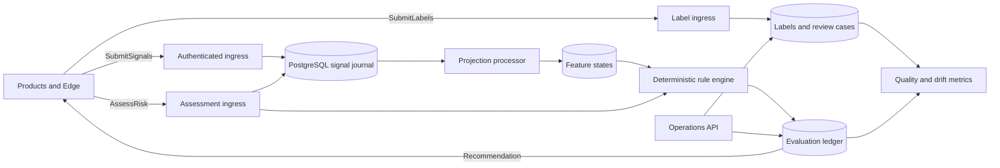

# Trust/Risk Service Design

## Status

Validated in design review on 2026-08-24. This document defines the first
implementation scope for an independent Trust/Risk bounded context. It does not
authorize product enforcement or a production cutover.

## Decision

Create an autonomous Rust service that owns cross-product fraud, abuse, bot and
risk intelligence for nvbes. The service durably ingests versioned signals,
correlates pseudonymized subjects, materializes replayable features, evaluates
immutable rule sets, records explainable recommendations, and learns from
append-only labels.

The first runtime uses PostgreSQL as its source of truth and keeps ingress,
processing and operations in one deployable with explicit module boundaries.
The event model and storage layout prepare a measured migration to
Kafka/Redpanda, Flink and ClickHouse without application dual-writes or producer
contract changes.

Billing checkout is the first acceptance scenario. It is not the service
boundary, and the archived `billing-service` is not restored by this work.

This design implements ADR 0006: Trust/Risk owns shared correlation and risk
recommendations, while each product owns its business-specific policy,
degraded-mode decision and final enforcement.

## Goals

- Establish Trust/Risk as a bounded context independent from Billing, Identity,
  Cloud, Developer, Enterprise, Account and Edge.
- Give every producer a small, authenticated and versioned contract for risk
  signals, synchronous assessments and outcome labels.
- Correlate network, device, principal, tenant and machine activity without
  storing unnecessary raw identifiers or product payloads.
- Produce deterministic, explainable and reproducible risk evaluations.
- Support authoritative automatic labels and controlled human labels without
  rewriting history.
- Make every derived feature reconstructible from the signal journal.
- Enforce regional isolation, least privilege, bounded retention and safe
  observability.
- Define measurable conditions and a shadow migration path for streaming
  infrastructure.

## Non-goals

The first implementation does not include:

- restoration of the archived `billing-service`;
- automatic enforcement in any product;
- a Backoffice user interface;
- a browser SDK that collects anti-bot signals;
- machine-learning training or model serving;
- Kafka, Redpanda, Flink or ClickHouse;
- cross-region raw-signal replication or global subject correlation;
- product-specific business rules such as payment amount thresholds, workspace
  suspension rules or MFA policy;
- arbitrary scripts, dynamically loaded code or user-authored SQL in the rule
  engine.

The archived Risk Decision Center remains a reference for a later operations UI.
It is not a reference architecture for the engine because it aggregated
product-owned scores instead of owning signal processing and evaluation.

## Architecture



### Workspace components

#### `libs/rust/trust-risk`

The public Rust boundary contains:

- authenticated tonic clients;
- generated protobuf types and safe domain conversions;
- typed signal, subject, assessment, decision, reason and label primitives;
- idempotency and schema-version validation;
- redacted client errors;
- test builders and a deterministic in-memory fake for product tests.

The crate must not depend on a product crate, SQLx, PostgreSQL or an external
risk provider.

#### `apps/trust-risk-service`

The Rust runtime contains focused modules for:

- configuration and startup validation;
- workload authentication and producer authorization;
- signal, assessment and label gRPC ingress;
- schema validation and normalization;
- PostgreSQL persistence and migrations;
- subject linking and feature projection;
- rule parsing, validation, activation and evaluation;
- evaluation, reason and feature-snapshot persistence;
- label resolution and review-case state transitions;
- operations APIs, audit, retention and metrics;
- liveness, readiness and graceful shutdown.

Ingress, projection processing and operations run in one binary initially. Their
modules communicate through typed interfaces and database records rather than
calling each other's private implementation details. This permits later runtime
separation without changing public contracts.

### Service ownership

Trust/Risk owns:

- canonical signal schemas and producer permissions;
- cross-product subject reputation and behavioral correlation;
- reusable risk features and their versions;
- shared rule sets and recommendation semantics;
- evaluation, label, review and quality history;
- risk-specific audit and observability.

Each product owns:

- collection of signals that require product context;
- strictly business-specific features and rules;
- whether and how it calls the synchronous assessment API;
- explicit fail-open, fail-closed or fail-challenge behavior;
- final allow, challenge, hold, limit, suspend or deny enforcement;
- feedback about the outcome of its operation.

## Contracts

The wire contract lives at
`contracts/protobuf/nvbes/trust_risk/v1/trust_risk.proto` under package
`nvbes.trust_risk.v1`.

### Canonical signal envelope

Every signal contains:

- a globally unique `signal_id` used for idempotency;
- an explicit `schema_version`;
- an authenticated `producer` and namespaced `signal_kind`;
- `occurred_at` and server-assigned `received_at` timestamps;
- a stable logical partition key;
- one or more opaque subject references;
- typed, bounded attributes validated against the signal schema;
- correlation and request identifiers when available;
- a declared regional, tenant or global-derived scope.

Signal kinds describe observations rather than product objects. Initial families
include:

- `network.*` for reputation and topology evidence;
- `device.*` for client integrity and device continuity;
- `automation.*` for bot and behavioral evidence;
- `identity.*` for authentication and session evidence;
- `velocity.*` for producer-derived bursts and reuse;
- `payment.*` for attempts, failures, disputes and authoritative provider
  outcomes;
- `usage.*`, `sharing.*` and `exfiltration.*` for product abuse evidence;
- `reputation.*` for bounded positive and negative history.

Attributes use a protobuf value union restricted to string, signed integer,
unsigned integer, boolean, bounded decimal and opaque bytes. Each schema
allowlists keys, types, cardinality, size and lateness. Unbounded JSON is not
accepted.

### Subject references

A subject reference contains a kind, namespace, opaque identifier and scope.
Supported kinds initially include principal, device, network, tenant, workload
and anonymous session.

Platform UUIDs may be used only where they are already opaque internal
identifiers. Email addresses, names, credentials, access tokens, raw device
fingerprints and user content are forbidden. Network and device references come
from an approved platform tokenization boundary that produces consistent HMAC
identifiers and derived characteristics without distributing ad hoc correlation
keys to product code.

Tenant-scoped operational identifiers and cross-product correlation keys are
stored separately. Product responses never reveal a correlation key or the
existence of activity owned by another tenant.

### `SubmitSignals`

`SubmitSignals` durably accepts a bounded batch of asynchronous signals.

- A new signal returns its stable receipt.
- An identical retry returns the original receipt.
- Reusing a `signal_id` with different immutable content returns `AlreadyExists`
  and emits a security metric.
- Authentication, authorization, schema, clock, size or scope failures reject
  the request without persisting the forbidden payload.

The receipt means the PostgreSQL journal accepted the signal. It does not mean
all projections already include it.

### `AssessRisk`

`AssessRisk` evaluates a current operation. Its request contains:

- an idempotent `assessment_key` scoped to the producer;
- a generic operation class rather than a product DTO;
- opaque subjects and regional context;
- optional instantaneous evidence using the canonical signal schema;
- the caller's correlation context and deadline.

Instantaneous evidence and the evaluation are persisted atomically. The response
contains:

- stable `evaluation_id`;
- integer score in the inclusive range `0..=100`;
- risk band `low`, `elevated`, `high` or `critical`;
- recommendation `allow`, `challenge`, `review` or `deny`;
- stable reason codes with safe, bounded parameters;
- feature schema and rule-set versions;
- evaluation time and expiration;
- whether the response was an idempotent replay.

The response is a recommendation. It cannot enforce a product action.

### `SubmitLabels`

`SubmitLabels` appends outcome assertions associated with an evaluation, review
case or subject. A label contains:

- stable label identifier and schema version;
- label kind such as `legitimate`, `confirmed_fraud`, `bot`,
  `account_takeover`, `chargeback` or `false_positive`;
- source class, source identifier and confidence;
- author when the source is human;
- knowledge time and optional evidence reference;
- mapping version for automatic sources;
- correction link when superseding an earlier assertion.

Labels never mutate old evaluations or delete earlier assertions.

### Operations contract

A separately authorized `RiskOperationsService` supports:

- reading an evaluation with its safe feature snapshot and reasons;
- listing and reading review cases;
- assigning a case and changing its state;
- submitting or correcting a human label;
- listing label history;
- validating, staging, activating and rolling back rule sets;
- reading health and quality summaries.

The later Backoffice UI consumes this contract. The engine never depends on the
Backoffice application.

## Persistence model

PostgreSQL is the V0 source of truth. The schema uses explicit tables rather than
a generic document store:

- `trust_risk_signal_events`: immutable canonical signal envelope and bounded
  attributes;
- `trust_risk_signal_subjects`: normalized subject links and scopes;
- `trust_risk_projection_offsets`: idempotent processor progress;
- `trust_risk_feature_states`: current versioned, reconstructible feature
  projections;
- `trust_risk_rule_sets`: immutable typed rule definitions and activation
  metadata;
- `trust_risk_evaluations`: immutable score, band, recommendation and versions;
- `trust_risk_evaluation_features`: exact safe feature snapshot used by an
  evaluation;
- `trust_risk_evaluation_reasons`: stable ordered reasons;
- `trust_risk_label_assertions`: immutable automatic and human assertions;
- `trust_risk_label_resolutions`: derived canonical label and provenance;
- `trust_risk_review_cases`: current review state and assignment;
- `trust_risk_review_case_events`: append-only case history;
- `trust_risk_processing_failures`: retry and quarantine state;
- `trust_risk_outbox_events`: semantic lifecycle events when an external
  publisher is configured.

Raw signals and immutable evaluations are never updated by projection work.
Mutable feature, resolution and case-state tables have an append-only history or
can be reconstructed from immutable records.

The service creates outbox rows only for configured semantic consumers. Future
raw-signal streaming uses CDC from the canonical journal, not an application
write to Kafka.

## Processing model

### Signal ingestion

Ingress authenticates the workload, resolves its producer policy, validates the
signal schema and writes the event plus subject links in one transaction. Batch
limits and admission quotas are applied before expensive validation.

`occurred_at` controls event-time windows. Server-assigned `received_at` controls
operational age and retention. Each schema defines maximum clock skew and allowed
lateness so the same semantics can later become Flink watermarks.

### Feature projection

The processor claims journal rows with `FOR UPDATE SKIP LOCKED`, computes an
idempotent projection mutation and advances its offset in the same transaction.
Initial features include:

- counts and distinct counts over bounded time windows;
- reuse of a subject across principals or tenants;
- network, device and client-integrity reputation;
- automation and interaction evidence accumulation;
- positive and negative history with bounded decay;
- multi-signal combinations expressed by typed rules.

Projection algorithms are versioned. A new feature version can rebuild beside
the active version before activation. Derived state is a cache of the journal,
never its source of truth.

Late events inside their schema allowance update affected windows. Events later
than the allowance remain in the journal and increment a quality metric but do
not silently rewrite active feature state. An explicit rebuild can include them
under a new feature version.

### Synchronous evaluation

`AssessRisk` performs these steps within a bounded request:

1. validate and persist instantaneous evidence;
2. load the active feature version for the supplied subjects;
3. select the atomically active immutable rule set;
4. run the pure deterministic evaluator;
5. persist the evaluation, feature snapshot and reasons;
6. return the persisted result.

The transaction uses database time for evaluation and expiration. An idempotent
retry returns the original immutable evaluation even if the active rule set has
changed.

Target service latency within one region, excluding caller network time, is:

- p95 below 50 ms;
- p99 below 100 ms.

Product SDKs apply an explicit deadline and return a typed availability error.
They never convert an error into `allow` or another recommendation.

## Rule engine

The V0 engine evaluates a typed rule AST compiled into Rust domain types. It does
not execute scripts, SQL, WASM or dynamically loaded code.

A rule may:

- test a versioned feature or safe assessment attribute;
- combine predicates with bounded boolean operators;
- add or subtract a bounded score contribution;
- emit a stable reason code;
- raise the minimum risk band or recommendation.

Each score contribution is bounded, and the final score is clamped to
`0..=100`. Recommendation thresholds and precedence are validated before a rule
set can be staged. Rules are evaluated in a deterministic declared order, and
the strictest raised recommendation wins.

Rule sets are immutable after creation. Staging runs schema validation, static
checks and golden datasets. Activation is atomic, requires Risk administration
permission and dual control, and writes an audit event. Rollback activates a
previously validated version; it never edits history.

Trust/Risk rules express cross-product risk. Product-specific thresholds and
actions remain in product code. Products may use the operation class to select a
shared assessment profile, but they cannot upload executable product logic.

## Labels and review

The system distinguishes observations, evaluations, labels and review cases.
A failed payment is a signal, not a fraud label.

Automatic labels are accepted only from authorized source mappings. Examples of
authoritative outcomes include a provider-confirmed fraud chargeback, an
Identity-confirmed account takeover or a verified abuse investigation. Weak
heuristics remain signals and cannot become authoritative labels.

Canonical label resolution uses this precedence:

1. controlled human decision;
2. authoritative external outcome;
3. verified product outcome;
4. heuristic assertion, retained as weak evidence only.

A correction appends a superseding assertion. The resolver records which
assertions produced the current canonical label.

An evaluation recommending `review` may create one idempotent review case. The
V0 state machine is:

```text
open -> in_review -> resolved
                  -> inconclusive
```

Every transition records actor, reason and time. Resolving a case as confirmed or
legitimate requires a label assertion. `inconclusive` records no authoritative
label.

Quality metrics are grouped by risk family, feature version and rule-set
version. They include label coverage, precision, recall when the observed labels
make it measurable, false-positive rate, challenge/review/deny rates, resolution
lag and feature-distribution drift. Unresolved evaluations are never counted as
known legitimate outcomes.

Labels can influence future reputation only through a versioned, bounded and
decaying feature with explicit provenance. They never retroactively change an
old score.

## Security and privacy

### Authentication and authorization

- All gRPC calls require authenticated workload identity and encrypted
  transport.
- Producer policies restrict tenant scope, subject namespaces, signal families,
  batch size and request rate.
- Ingestion, assessment, label-source and operations permissions are distinct.
- Human review, rule administration and audit access use dedicated RBAC.
- Rule activation and authoritative-source changes require dual control.

### Data minimization

The service rejects secrets, credentials, access tokens, raw fingerprints,
names, email addresses and user content. Signal schemas expose only fields needed
for an approved risk purpose.

Logs, metrics, tracing, errors and audit metadata contain identifiers suitable
for operations but no forbidden payload, raw subject value or exploitable rule
detail. Returned reasons are stable categories rather than a dump of internal
features.

### Regional isolation

Each data-residency region runs its own Trust/Risk runtime and database. Raw
signals, raw subject links and detailed feature snapshots do not cross regions.

Contracts distinguish `regional`, `tenant` and `global_derived` scope from V0.
`global_derived` is reserved and rejected until a separately reviewed federation
design authorizes bounded, non-identifying reputation exchange.

### Retention and erasure

Retention is a required, versioned per-region policy supplied at production
startup. The runtime refuses production readiness when any signal family,
feature family, evaluation, label, review or audit class lacks a reviewed
retention rule.

Detailed signals use short retention. Feature state lasts only for its declared
window, decay and replay margin. Evaluations and labels retain the history needed
for quality measurement and appeal. Audit retention follows the platform audit
policy. Legal holds are explicit records, not silent configuration overrides.

Erasing a subject removes or cryptographically severs reidentifying links,
invalidates its active feature projections and schedules a bounded rebuild.
Only non-reidentifying aggregate evidence with a documented legal basis may
remain.

## Failure handling

### Synchronous calls

`AssessRisk` returns typed gRPC errors for invalid input, authorization failure,
conflict, deadline, unavailable storage and internal evaluation failure. It never
returns a fabricated recommendation during an error.

The product documents one degraded behavior for each protected operation. The
Billing checkout acceptance fixture uses observation-only `fail-open`, but that
fixture does not define another product's policy.

### Asynchronous processing

Transient projection failures retain the journal event and schedule bounded
exponential retry with jitter. Repeated deterministic failures enter an
inspectable quarantine record with safe diagnostics. Quarantine never deletes or
marks the source event as successfully projected.

Reprocessing is idempotent. Operators can retry a quarantined event after a code,
schema or configuration correction. A poison event cannot create an infinite hot
loop.

### Health

- `/health/live` reports process and HTTP runtime liveness only.
- `/health/ready` requires reachable PostgreSQL, current migrations, a valid
  active feature/rule configuration and a current projection heartbeat.
- gRPC health reports serving status for each registered service.

Readiness does not depend on a product, Backoffice or future streaming system.

## Observability

Metrics include:

- accepted, duplicate, rejected and conflicting signals by safe family and
  producer;
- ingest latency, assessment latency and gRPC outcome;
- journal-to-projection lag, retry and quarantine counts;
- active feature and rule versions;
- score, band and recommendation distributions;
- review backlog and resolution lag;
- label coverage and quality metrics;
- retention, rebuild and erasure progress.

Structured logs carry request, producer, evaluation, rule version and safe
regional context. High-cardinality subject identifiers are excluded from metric
labels. Traces do not record signal attributes or feature values.

## V0 acceptance scenario

Billing checkout is represented by a test producer and golden dataset, not by a
restored Billing runtime. The fixtures cover:

- a known legitimate subject on a residential network;
- a new subject with elevated network risk;
- coordinated reuse of a network or device across multiple subjects;
- repeated attempts and payment failures;
- provider-confirmed chargeback feedback;
- a human false-positive correction;
- idempotent signal, assessment and label retries;
- a Trust/Risk outage where the simulated product applies its explicit
  observation-only fail-open policy.

The inputs use only canonical signal kinds and generic operation classes. No
Billing DTO or Billing crate dependency is allowed in the engine or client
crate.

## Verification strategy

### Unit and property tests

- deterministic output for the same feature and rule versions;
- score bounds and strict recommendation precedence;
- stable ordered reason codes;
- rule-AST validation and rejection of unsafe complexity;
- label precedence, corrections and non-retroactivity;
- review-case state-machine invariants;
- subject and schema validation.

### Contract tests

- protobuf encode/decode and safe domain conversion;
- backward compatibility within `v1`;
- producer authorization for signal and subject namespaces;
- idempotency receipt behavior and conflicting reuse;
- redaction of all public errors.

### PostgreSQL integration tests

- concurrent duplicate ingestion;
- `SKIP LOCKED` projection claiming;
- transaction rollback across evidence and evaluation persistence;
- event-time windows, allowed lateness and too-late metrics;
- feature-version side-by-side rebuild;
- exact projection reconstruction from the journal;
- bounded retry, quarantine and operator replay;
- retention, erasure and legal-hold behavior.

### End-to-end and security tests

- real PostgreSQL with all gRPC services and processor loop;
- all Billing checkout golden scenarios;
- workload authentication, producer ACL and operations RBAC;
- cross-tenant and cross-region disclosure resistance;
- label-source spoofing and feedback-poisoning attempts;
- logs, traces, metrics and errors scanned for forbidden data;
- graceful shutdown with accepted work preserved.

### Performance tests

Load tests establish a reviewed PostgreSQL capacity envelope and verify:

- assessment p95 below 50 ms and p99 below 100 ms;
- bounded ingestion latency under the expected batch mix;
- steady-state projection lag below 5 seconds;
- backpressure before database saturation;
- complete projection rebuild within 4 hours at the validated V0 retention
  volume.

## Streaming migration readiness

V0 preserves the following invariants for a later migration:

- globally unique, versioned and replayable event envelopes;
- explicit partition keys and event-time semantics;
- immutable source journal and reconstructible projections;
- versioned features, rules, evaluations and labels;
- CDC-compatible inserts without application Kafka writes;
- semantic outbox events only when a consumer is configured;
- quality comparison keyed by feature and rule version.

Migration work starts when at least one measured condition is met:

- sustained production load exceeds 70% of the validated PostgreSQL capacity
  envelope;
- assessment p99 or projection lag remains outside its SLO after planned
  PostgreSQL tuning and safe vertical scaling;
- a full replay cannot complete within the 4-hour recovery objective;
- required event-time windows or joins make PostgreSQL projection code unsafe or
  operationally dominant;
- analytical workloads cannot remain isolated from the transactional path.

The migration sequence is:

1. publish the canonical PostgreSQL journal to Kafka/Redpanda through CDC;
2. compute a new feature version in Flink without serving it;
3. compare feature values, score distributions, evaluation deltas and quality
   metrics in shadow;
4. activate one verified feature family at a time;
5. retain the PostgreSQL evaluation ledger until transactional replacement has
   separate approval;
6. feed ClickHouse from the stream for analytics and drift dashboards only.

No producer contract changes and no PostgreSQL/Kafka application dual-write are
permitted during the migration.

## Implementation boundaries

- Code files follow the repository's flat, qualified Rust naming convention.
- Production files remain below 300 lines where practical and must be extracted
  before 500 lines.
- Persistence, pure validation, projection, evaluation and orchestration live in
  separate modules.
- Stateless capabilities use module functions rather than service structs.
- Dependencies are explicit; business functions do not receive a global state
  object.
- The service uses existing audit, observability, platform and regional
  primitives where their contracts fit, without depending on archived apps.
- No warning suppression, provisional adapter or incomplete production path is
  accepted.

## Completion criteria

The V0 implementation is complete only when:

- all public contracts and producer policies are versioned and documented;
- ingestion, projection, assessment, labels and review work end to end against a
  real PostgreSQL database;
- evaluations are reproducible from their stored feature and rule versions;
- all derived feature state reconstructs exactly from retained source events;
- product-specific DTOs and enforcement logic are absent from Trust/Risk;
- the Billing checkout fixture passes without linking the Billing crate;
- authorization, isolation, redaction, retention and erasure tests pass;
- latency, lag, backpressure and replay targets pass at the documented capacity
  envelope;
- targeted Nx checks and `cargo check --workspace` pass;
- operational limitations and the measured streaming migration envelope are
  documented.
