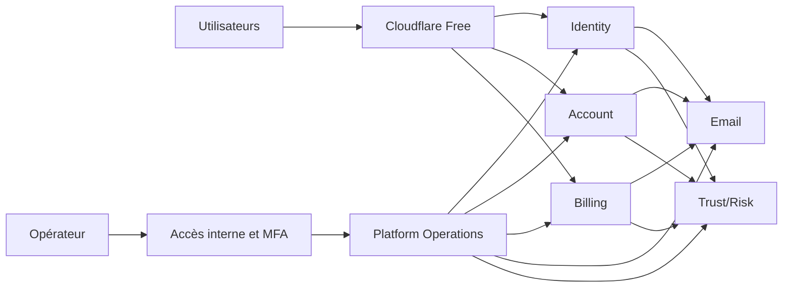
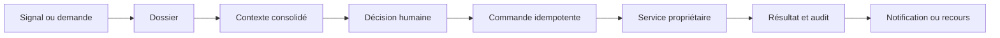

# Socle nvbes V1 piloté par FinOps et Platform Operations

## Statut

Conception validée section par section le 25 août 2026.

Ce document définit le socle réutilisable de nvbes V1. Il ne constitue pas un
plan d'implémentation et n'autorise pas encore une ouverture publique.

## Décision

Construire un socle B2C public réutilisable, compatible avec la collaboration
en équipe, autour de six bounded contexts déployables :

1. Identity ;
2. Account ;
3. Billing ;
4. Email ;
5. Trust/Risk ;
6. Platform Operations.

La V1 utilise une infrastructure Scaleway serverless capable de descendre à
zéro, protégée par Cloudflare et observée par les paliers gratuits disponibles.
Le coût récurrent total de production, taxes, domaines et fournisseurs compris,
est plafonné à 30 EUR par mois. La cible opérationnelle est 20 EUR afin de
conserver 10 EUR de réserve.

Le traitement humain est la valeur par défaut. Une automatisation n'est ajoutée
que lorsqu'elle réduit un volume manuel mesuré, protège une propriété critique
ou empêche un dépassement budgétaire. Une solution maison est recevable si son
coût total, sa sécurité, sa maintenance et sa remplaçabilité sont meilleurs que
les solutions disponibles.

## Contexte produit

Le premier produit nvbes n'est pas encore arrêté et Cloud n'est pas supposé
être ce premier produit. La V1 doit donc établir les capacités communes sans
dépendre de Cloud ni d'un autre produit final.

La cible initiale est le grand public B2C. Les utilisateurs peuvent néanmoins
former des équipes, des petites collaborations jusqu'aux groupes importants.
Les fonctions Enterprise, les contrats B2B, les certifications et les
workflows de conformité avancés sont reportés. Les frontières retenues ne
doivent pas empêcher leur ajout dans une version future.

Le dépôt contient un Backoffice historique archivé. Il sert d'inventaire de
besoins, pas de base d'implémentation. Platform Operations est reconstruit comme
un domaine minimal, centré sur les opérations réelles de la V1. Le moteur
Trust/Risk reste indépendant et ne devient ni un Backoffice ni le propriétaire
des décisions métier.

## Principes directeurs

- Aucune dette structurelle connue n'est acceptée à la sortie de V1.
- Après V1, toute dette est enregistrée, évaluée, attribuée et traitée
  proactivement.
- Les frontières de code, de données et de contrats restent strictes même si
  l'infrastructure physique est mutualisée.
- Mutualiser une capacité ne signifie pas créer automatiquement un microservice.
- La production monte en charge progressivement et chaque ouverture est
  réversible.
- Le coût est une propriété de conception et une condition de livraison.
- Les opérations manuelles doivent être sûres, explicables et auditables.
- La résilience initiale privilégie une restauration démontrée plutôt qu'une
  redondance permanente incompatible avec le budget.

## Objectifs

- Donner à tout futur produit une identité, un compte, une facturation, un
  service email et une évaluation Trust/Risk cohérents.
- Permettre à un opérateur solo de comprendre et traiter les incidents,
  demandes et abus depuis un point interne commun.
- Attribuer les coûts à un domaine et à une unité de consommation.
- Garantir que les dépenses autorisées restent bornées sous 30 EUR TTC par mois.
- Valider le socle avec un parcours synthétique complet avant tout produit.
- Préparer l'ajout futur d'opérateurs sans privilège codé en dur ni refonte des
  autorisations.
- Permettre le remplacement d'une solution maison par un fournisseur sans
  modifier les contrats consommés par les produits.

## Hors périmètre

- Cloud, Drive ou tout autre produit utilisateur final ;
- fonctionnalités Enterprise et administration B2B ;
- certifications ou programme de conformité avancé ;
- modération de contenus propre à un produit encore inexistant ;
- haute disponibilité applicative multi-région ;
- Kubernetes, Kafka, Redis, ClickHouse ou moteur de workflow dédié ;
- canaux de notification autres que l'email ;
- décisions Trust/Risk automatiquement bloquantes lors du premier déploiement ;
- support ou modération entièrement automatisés.

## Frontières des services

### Identity

Identity possède l'authentification, les credentials, les sessions, le MFA, la
récupération et les décisions d'autorisation qui relèvent de l'identité. Il ne
possède ni le profil produit ni l'abonnement.

### Account

Account possède le profil, les préférences et les relations de collaboration
entre comptes et équipes. Le modèle autorise les équipes sans introduire les
fonctions Enterprise reportées.

### Billing

Billing possède le catalogue, les prix, abonnements, paiements, webhooks,
réconciliation, quotas commerciaux et entitlements. Les futurs produits
consomment ses contrats et ne réinterprètent pas les statuts fournisseur.

### Email

Email possède l'acceptation durable des commandes, le rendu, la délivrabilité,
les retries, les suppressions et les événements fournisseur. Il constitue
l'unique canal de notification V1 derrière un contrat de notification
extensible.

### Trust/Risk

Trust/Risk possède les signaux transversaux, la corrélation, les évaluations
déterministes, la réputation et les raisons explicables. Il recommande une
action ; le domaine propriétaire de l'opération décide de l'enforcement final.
Le premier déploiement fonctionne en shadow mode.

### Platform Operations

Platform Operations possède :

- les dossiers de support, sécurité, abus et facturation ;
- les signalements et leur contexte minimisé ;
- les décisions humaines, motifs et recours ;
- les commandes opérateur et leurs résultats ;
- le registre de coûts, les prévisions et alertes FinOps ;
- la vue consolidée des audits exposés par les autres services.

Platform Operations ne possède pas de copie modifiable des comptes,
abonnements, paiements, emails ou évaluations. Il lit les APIs des domaines et
émet des commandes authentifiées. Il n'accède jamais directement à leur base.

## Topologie d'exécution

- Chaque service est un conteneur Scaleway configuré avec zéro instance
  minimale et une limite maximale explicite.
- Chaque bounded context possède sa propre ressource PostgreSQL Serverless,
  son propriétaire IAM et ses migrations. Aucun schéma métier n'est partagé.
- Les bases peuvent descendre à zéro CPU et utilisent les sauvegardes gérées.
- Une région Scaleway, un registry, une zone Cloudflare et une stack
  d'observabilité sont mutualisés.
- Les tâches ponctuelles utilisent Serverless Jobs.
- Le staging et les previews sont éphémères. Aucun environnement non productif
  permanent n'est facturé.
- Les échanges synchrones utilisent des contrats HTTP ou gRPC versionnés.
- Les échanges asynchrones initiaux utilisent une outbox PostgreSQL versionnée,
  idempotente et rejouable.

## Capacités mutualisées non déployables

Les capacités suivantes sont des bibliothèques, contrats ou modules partagés :

- format d'audit append-only ;
- idempotence des commandes et webhooks ;
- outbox, jobs, retries bornés et dead-letter ;
- authentification et autorisation interservices ;
- propagation du `request_id`, traces, métriques et erreurs ;
- unités de coût, budgets, quotas et consommation FinOps ;
- configuration progressive, feature flags et kill switches versionnés ;
- primitives de rate limiting et de quotas ;
- contrat de notification dont Email est le premier adaptateur ;
- contrats OpenAPI/gRPC et SDK générés.

Les entitlements restent une capacité interne de Billing. FinOps, Feature Flags,
Workflow, Audit et Notifications ne deviennent pas des services séparés en V1.

Une capacité est extraite dans un nouveau service uniquement si une mesure
démontre au moins un des besoins suivants : déploiement indépendant, données au
cycle de vie autonome, disponibilité différente, plusieurs consommateurs
réseau stables ou contention réelle.

## Workflow opérateur

Un dossier suit les états `open`, `investigating`, `awaiting_user`,
`action_pending`, `resolved`, `appealed` puis `closed`. Il appartient à une
catégorie stable : compromission de compte, fraude ou abus, paiement,
délivrabilité email, demande relative aux données ou incident technique.

La création peut être manuelle depuis un signal ou une demande. Seuls les
événements critiques déterministes créent automatiquement un dossier en V1.

Une décision contient l'opérateur, le motif, les références de preuve, la
commande demandée et, si nécessaire, une expiration. Le résultat du service
propriétaire est enregistré sans réécrire la décision originale. Un recours
ouvre une nouvelle étape du même historique.

## Sécurité opérateur

- Le premier opérateur reçoit `platform_owner`. Aucun email ou identifiant
  personnel n'est codé en dur.
- Lecture et action utilisent des permissions distinctes dès la V1.
- MFA et step-up sont obligatoires pour une action sensible.
- Les données personnelles sont masquées par défaut.
- L'usurpation complète d'une session utilisateur est interdite.
- Toute commande sensible exige un motif et une clé d'idempotence.
- Une restriction temporaire possède une expiration.
- La suspension temporaire est préférée à la suppression irréversible.
- Une suppression irréversible est différée, annulable pendant son délai de
  sécurité et exige un nouveau step-up lors de l'exécution.
- Une commande au résultat incertain reste `pending` ou `unknown` ; elle n'est
  jamais répétée aveuglément.

Les futures capacités `support_agent`, `risk_reviewer`, `billing_operator` et
`security_admin` restent séparées dans le modèle d'autorisation, même si seul
`platform_owner` est attribué lors de la V1.

## Contrat FinOps

Le budget mensuel est suivi taxes comprises et amortit les dépenses annuelles,
notamment les domaines.

| Poste | Cible mensuelle | Limite mensuelle |
| --- | ---: | ---: |
| Domaine et DNS | 2 EUR | 3 EUR |
| Compute serverless | 3 EUR | 6 EUR |
| PostgreSQL | 4 EUR | 8 EUR |
| Email | 1 EUR | 2 EUR |
| Stockage, sauvegardes et registry | 2 EUR | 4 EUR |
| Observabilité et erreurs | 0 EUR | 2 EUR |
| Marge de sécurité | 8 EUR | sans consommation assignée |
| Réserve d'urgence | 10 EUR | sans consommation assignée |
| Total cible | 20 EUR | 30 EUR |

Chaque domaine déclare :

- son coût fixe ;
- ses unités marginales pertinentes ;
- ses quotas par minute, jour et mois ;
- son coût prévisionnel à trente jours ;
- ses traitements essentiels et non essentiels ;
- son mode économique dégradé ;
- la condition qui justifie une optimisation, migration ou hausse de budget.

Le calcul inclut au minimum comptes, emails, évaluations Trust/Risk, paiements,
stockage, requêtes, télémétrie et trafic sortant lorsqu'ils sont facturables.

### Garde-fous

- CI refuse une ressource payante sans propriétaire, plafond et justification.
- Conteneurs, bases, télémétrie, emails, registry et stockage ont des quotas et
  règles de rétention explicites.
- Les dépenses déclenchent des alertes à 15, 20 et 25 EUR.
- À 25 EUR, les traitements non essentiels sont désactivés.
- À 28 EUR, la création de nouvelles charges coûteuses est gelée.
- À 30 EUR, les nouvelles opérations utilisateur facturables sont gelées. Les
  parcours de récupération, la livraison de leurs emails et l'ingestion durable
  des webhooks fournisseur restent disponibles afin de préserver l'intégrité
  des comptes et paiements existants.
- Les garde-fous budgétaires critiques sont automatiques ; les autres demandes
  restent manuelles tant que leur volume ne justifie pas une automatisation.

Les limites applicatives précèdent les limites fournisseur. Elles protègent
contre un coût non borné même lorsqu'une offre serverless facture à l'usage.

### Construire ou acheter

Une décision compare le prix fournisseur, le temps de développement, le temps
d'exploitation, le risque de sécurité, le coût d'une panne et la facilité de
remplacement. Le temps du fondateur est mesuré même lorsqu'il ne crée pas une
sortie immédiate de trésorerie.

Les solutions maison privilégiées en V1 sont la file PostgreSQL, les feature
flags versionnés, les quotas, le registre FinOps et les dossiers opérateur.
Elles utilisent des ports explicites afin de pouvoir être remplacées.

## Gestion des erreurs

- Identity refuse les mutations sensibles si une dépendance indispensable est
  indisponible.
- Account conserve un état explicite lorsqu'une opération distribuée reste
  incertaine.
- Billing considère un paiement indéterminé comme `pending` jusqu'au webhook ou
  à la réconciliation ; un timeout ne signifie jamais succès.
- Email persiste une commande avant livraison, applique un retry borné puis une
  dead-letter. Son échec n'annule pas une décision métier déjà validée.
- Chaque appel synchrone à Trust/Risk déclare son mode dégradé : allow,
  challenge ou deny. Aucun défaut implicite n'est accepté.
- Platform Operations passe en lecture seule lorsqu'il ne peut pas garantir
  l'exécution sûre d'une commande.
- Une panne de télémétrie ne bloque pas un parcours utilisateur.
- Les consommateurs et commandes supportent le rejeu sans double effet.

Avant l'ouverture aux comptes invités, l'objectif initial est un RPO inférieur
ou égal à 24 heures et un RTO inférieur ou égal à 8 heures, vérifiés par un
exercice de restauration. Ces objectifs assument une intervention manuelle et
ne constituent pas un SLA. Ils sont réévalués avec les risques et revenus du
premier produit avant les inscriptions publiques.

## Mise en production progressive

1. Livrer les primitives communes et les contrôles FinOps.
2. Déployer Email et valider des envois synthétiques.
3. Déployer Identity et Account avec accès interne uniquement.
4. Déployer Billing avec le fournisseur de paiement en mode test.
5. Déployer Trust/Risk en shadow mode.
6. Déployer Platform Operations.
7. Exécuter le parcours intégré, les tests de restauration et les smoke tests.
8. Ouvrir à un petit groupe de comptes invités.
9. Connecter le premier produit nvbes.
10. Autoriser les inscriptions publiques après mesure des coûts, abus et
    incidents du groupe invité.

Billing n'accepte des paiements réels qu'après validation des webhooks, de
l'idempotence et de la réconciliation. Trust/Risk ne bloque automatiquement
qu'après une phase shadow mesurée et une décision de conception distincte.

## Stratégie de tests

- tests unitaires des règles métier ;
- tests PostgreSQL avec migrations réelles ;
- tests de contrats OpenAPI et gRPC ;
- matrice des permissions et tests de step-up ;
- tests d'idempotence, retries, dead-letter et rejeu d'outbox ;
- scénarios de paiement, webhook et réconciliation ;
- jeux de référence déterministes Trust/Risk ;
- tests des quotas, prévisions et transitions FinOps ;
- tests des cold starts et modes dégradés ;
- restauration réelle depuis une sauvegarde ;
- smoke tests post-déploiement ;
- parcours intégré Identity, Account, Billing, Email, Trust/Risk et Operations.

## Gates de livraison

Une version ne passe en production que si :

- les checks ciblés et transverses sont verts ;
- aucune migration destructive non protégée n'est présente ;
- les artefacts sont immuables et identifiables ;
- les secrets sont séparés du code et limités au service concerné ;
- les alertes et le runbook existent ;
- une restauration a été exécutée avec succès ;
- le coût prévisionnel reste inférieur ou égal à 20 EUR TTC ;
- le pire scénario autorisé par les quotas reste inférieur ou égal à 30 EUR
  TTC ;
- aucun élément nécessaire au fonctionnement n'est marqué provisoire ;
- aucune dette structurelle connue n'est reportée.

## Gestion proactive de la dette après V1

Toute dette acceptée après V1 comporte un propriétaire, une cause, un impact,
une mesure, une date de révision et une condition de résolution. Une dette sans
ces éléments est un défaut, pas un élément de backlog valide.

Une revue régulière rapproche le registre de dette des incidents, coûts,
latences et volumes réels. Les optimisations spéculatives et les migrations
d'infrastructure sans seuil mesuré sont refusées.

## Critères d'acceptation du socle

Le socle V1 est complet lorsque :

- un compte synthétique traverse Identity et Account ;
- les messages transactionnels correspondants sont livrés et traçables ;
- Billing exécute un parcours fournisseur de test et le réconcilie ;
- Trust/Risk produit une recommandation shadow déterministe et explicable ;
- un dossier opérateur consolide le parcours et exécute une commande sûre ;
- chaque étape possède un audit et un identifiant de corrélation ;
- les coûts sont attribuables par domaine et restent sous les deux gates ;
- une restauration complète est démontrée ;
- le socle fonctionne sans Cloud ni autre produit final.

La connexion du premier produit fait l'objet d'une conception et d'un plan
séparés. Elle ne modifie pas rétroactivement les responsabilités du socle.
